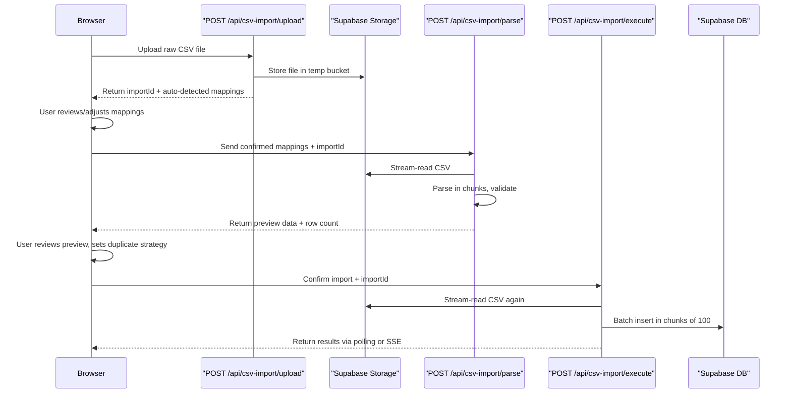

# CSV Import Rewrite

The current CSV import is fundamentally broken for the real Google Sheets export format. The client-side parser makes hardcoded assumptions that don't survive contact with the actual CSV, the column mapping step doesn't fully influence parsing, and the entire 10MB file is processed in browser memory with no chunking. This plan rewrites the pipeline.

---

## Problem Analysis

After tracing every line of the import flow against [docs/_CSV-example.csv](docs/_CSV-example.csv) (988 lines, ~20 test cases across 4 suites), here are the critical failures:

### 1. Header row detection is fragile and often wrong

[src/components/csv-import/ImportWizard.tsx](src/components/csv-import/ImportWizard.tsx) lines 63-66 look for a row where `col[0]` is `'id'`/`''`/`' '` AND `col[1]` is `'description'`. But in the real CSV, the **first** row is a test-case header (`Sponsor Registration SR-1,,Manual Testing Complete...`) and column headers repeat per test case. The fallback to `rows[0]` picks the WRONG row (the suite header, not a column header).

### 2. `classifyRow` requires the exact Google Sheets pattern but has subtle bugs

[src/lib/csv/classifier.ts](src/lib/csv/classifier.ts) `HEADER_RE` is `/^.+\s+[A-Z]{1,10}-\d+$/` which matches `"Sponsor Registration SR-1"` correctly. But it also matches any text ending in a pattern like `FOO-1`, potentially misclassifying data rows.

### 3. Hardcoded column indices bypass user mapping

In `parseDataFromRows()` (ImportWizard.tsx):

- Line 130: `datesCol = 7` — hardcoded instead of using `col.execution_date`
- Line 132: `overallStatusCol = 2` — hardcoded instead of using `col.overall_status`  
- The header row and step rows use DIFFERENT column layouts, but the mapper only knows about the step-row layout

### 4. Title is set to a generic "{SuiteName} {ID}" instead of the actual description

Line 140: `title: \`${suiteInfo.suiteName} ${suiteInfo.displayId}`— this never gets the real description/title from the first-step row because`currentCase.description`is set later but`title` is never updated from it.

### 5. `parseSuiteFromHeader` extracts suite info from header row col 0, but the AUTOMATION STATUS lives in col 4 of the HEADER ROW (not the mapped "Added to code" column 8)

The header row layout is: `[suite+id, empty, overall_status, empty, automation_status, empty, empty, execution_dates, ...]` — this is a completely different layout from step rows. The mapper maps the step-row column "Added to code" (index 8), but then uses that index to read from the header row where index 8 is something else entirely.

### 6. All parsing is client-side — 50K rows will freeze the browser

`FileReader.readAsText` loads the entire file, `parseCSV` builds the full `string[][]` in memory, and `parseDataFromRows` iterates everything synchronously. No Web Workers, no chunking, no streaming.

### 7. The API receives pre-parsed data as a single JSON blob

For a 50K-row CSV producing ~2000 test cases with 25 steps each, the JSON payload could be 20-50MB, exceeding Next.js default body size limits and causing timeouts.

---

## Architecture: Server-Side Processing

Move the heavy parsing to the server. The new flow:




---

## Implementation Tasks

### Task 1: Fix the core parser to handle the real CSV format correctly

The Google Sheets format has TWO distinct row layouts that must be parsed differently:

**Header row** (per test case): `["{SuiteName} {PREFIX}-{N}", "", "{OverallStatus}", "", "{AutomationStatus}", "", "", "{ExecutionDates}", ...]`

**Step rows** (after column header): `["{ID}", "{Description}", "{Precondition}", "{StepNum}", "{StepDesc}", "{TestData}", "{ExpectedResult}", "{PassFail}", "{AddedToCode}", "{Comments}", "{BugReport}"]`

Changes to [src/lib/csv/classifier.ts](src/lib/csv/classifier.ts):

- Make `classifyRow` more robust: check for the suite header pattern more strictly (require the header to NOT have data in step columns)
- Export constants for the fixed header-row column positions (0=suite+id, 2=overall_status, 4=automation_status, 7=execution_dates) since these are always in the same position per the Google Sheets export

Changes to [src/lib/csv/field-parsers.ts](src/lib/csv/field-parsers.ts):

- Add a `parseHeaderRow(row: string[])` function that extracts suite info, overall status, automation status, and execution dates from the FIXED header-row layout
- Keep existing step-row parsers as-is

Changes to [src/components/csv-import/ImportWizard.tsx](src/components/csv-import/ImportWizard.tsx) `parseDataFromRows()`:

- For `header` rows: use `parseHeaderRow()` with fixed positions (these are structural, not user-mappable)
- For `first_step`/`step` rows: use the user's column mappings via `buildColumnLookup()`
- Fix `title` to use the description from the first-step row, not the generic suite+id string
- Use `col.execution_date` and `col.overall_status` from mappings for step rows; use fixed positions only for header rows

### Task 2: Server-side CSV upload and storage

New API route: [src/app/api/csv-import/upload/route.ts](src/app/api/csv-import/upload/route.ts)

- Accept `multipart/form-data` with the raw CSV file + `project_id`
- Store in Supabase Storage bucket `csv-imports/{project_id}/{import_id}.csv`
- Create the `csv_imports` row with status `'pending'`
- Read the first ~50 rows to auto-detect column header and generate mappings
- Return `{ import_id, mappings, preview_rows, total_rows }`

### Task 3: Server-side parsing endpoint

New API route: [src/app/api/csv-import/parse/route.ts](src/app/api/csv-import/parse/route.ts)  

- Accept `{ import_id, confirmed_mappings }`
- Stream-read the CSV from storage
- Parse using the fixed logic from Task 1
- Return a preview of the first 20 parsed test cases + total count + duplicate detection
- Store confirmed mappings in `csv_imports.column_mappings`

### Task 4: Server-side batch import execution

Refactor [src/app/api/csv-import/route.ts](src/app/api/csv-import/route.ts) (or new `execute` route):

- Accept `{ import_id, duplicate_strategy }`
- Stream-read CSV from storage, parse in chunks
- Batch insert suites, test cases, steps, bug links in batches of 100
- Update `csv_imports` progress (imported_count, error_count) as chunks complete
- Create the import test run for platform results (existing logic from D1)
- For large files: update status via polling endpoint

### Task 5: Import progress polling endpoint

New API route: [src/app/api/csv-import/[importId]/progress/route.ts](src/app/api/csv-import/[importId]/progress/route.ts)

- Return current `csv_imports` row with live counts
- Client polls every 2 seconds during import

### Task 6: Rewrite the ImportWizard UI flow

Refactor [src/components/csv-import/ImportWizard.tsx](src/components/csv-import/ImportWizard.tsx):

**Step 0 (Upload):** Upload file via `FormData` to `/api/csv-import/upload`. Show upload progress bar. Receive back auto-detected mappings + preview.

**Step 1 (Map Columns):** Show `ColumnMapper` with server-provided mappings. User adjusts. Add `execution_date` to the ColumnMapper dropdown options in [src/components/csv-import/ColumnMapper.tsx](src/components/csv-import/ColumnMapper.tsx).

**Step 2 (Review):** POST confirmed mappings to `/api/csv-import/parse`. Show parsed preview from server. Show duplicates. Set strategy.

**Step 3 (Import):** POST to `/api/csv-import/execute`. Poll `/api/csv-import/{id}/progress` every 2s. Show live progress bar with real counts.

**Step 4 (Done):** Show summary from the completed import record.

### Task 7: Increase Next.js body size limit

In [next.config.ts](next.config.ts), add:

```typescript
experimental: {
  serverActions: { bodySizeLimit: '50mb' }
}
```

And for the upload route, use the streaming body API rather than `request.json()`.

### Task 8: Handle edge cases in the real CSV

From analysis of [docs/_CSV-example.csv](docs/_CSV-example.csv):

- Line 30: Column header row has `" "` (space) in col 0 instead of `"Id"` — classifier handles this
- Line 939: Column header says `"Test Steps Expected Results"` (plural) instead of `"Test Step Expected Result"` — add to fuzzy matching in [src/lib/csv/column-mapper.ts](src/lib/csv/column-mapper.ts)
- Multi-line fields (description with `\n` embedded in quotes) — parser already handles RFC 4180 quoting
- Varying suite prefixes in the same file: SR, SMU — parser handles this via per-header-row detection
- Some test cases span 50+ steps — batch inserts must handle this

---

## Files Modified


| File                                                  | Change                                                                       |
| ----------------------------------------------------- | ---------------------------------------------------------------------------- |
| `src/lib/csv/classifier.ts`                           | Tighten header detection, export fixed-position constants                    |
| `src/lib/csv/field-parsers.ts`                        | Add `parseHeaderRow()` for structured header-row extraction                  |
| `src/lib/csv/column-mapper.ts`                        | Add fuzzy match for "Test Steps Expected Results" (plural)                   |
| `src/components/csv-import/ImportWizard.tsx`          | Rewrite flow to use server APIs; fix title assignment; fix hardcoded indices |
| `src/components/csv-import/ColumnMapper.tsx`          | Add `execution_date` to dropdown options                                     |
| `src/components/csv-import/ImportProgressStep.tsx`    | Add polling for live progress                                                |
| `src/app/api/csv-import/upload/route.ts`              | NEW: file upload + storage + auto-detect                                     |
| `src/app/api/csv-import/parse/route.ts`               | NEW: server-side parsing with mappings                                       |
| `src/app/api/csv-import/route.ts`                     | Refactor to stream from storage; batch inserts                               |
| `src/app/api/csv-import/[importId]/progress/route.ts` | NEW: polling endpoint                                                        |
| `src/lib/validations/csv-import.ts`                   | Add upload/parse/execute schemas                                             |
| `next.config.ts`                                      | Body size limit for upload                                                   |


