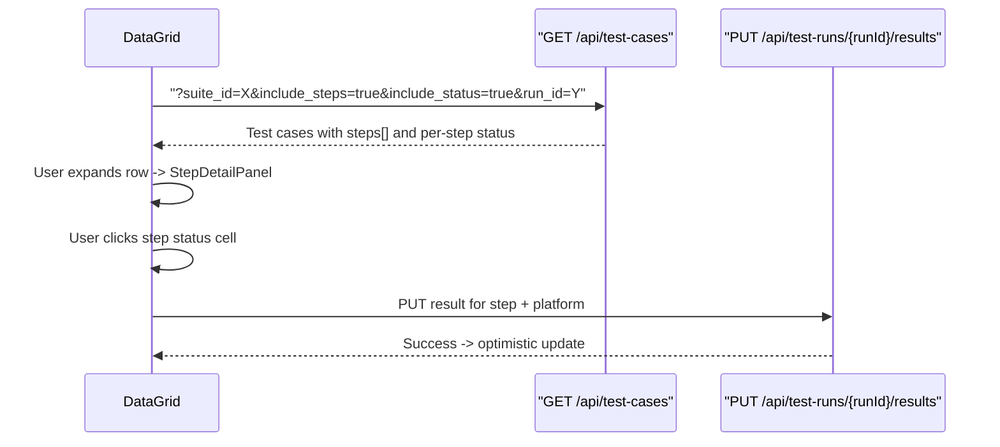

# Grid Steps, Step Pass/Fail, and Suite Categories

Three features that make the grid view actually useful for daily QA work.

---

## Feature 1: Expandable Test Steps in the Grid

Currently the only way to see steps is opening the side drawer. This adds an expand arrow on each test case row that reveals the steps inline, including pass/fail status from a selected test run.

### 1A: API — Include steps in the test cases list response

Modify [src/app/api/test-cases/route.ts](src/app/api/test-cases/route.ts) GET handler:

- Add `include_steps=true` query param
- When set, change the select to `*, test_steps(id, step_number, description, test_data, expected_result, is_automation_only)` 
- Also need step-level execution results: when `include_status=true` AND `include_steps=true`, fetch `execution_results` grouped by `(test_case_id, test_step_id, platform)` and attach to each step

Same change needed in [src/app/api/projects/[projectId]/test-cases/route.ts](src/app/api/projects/[projectId]/test-cases/route.ts) for the project-level grid.

### 1B: DataGrid — Add detail panel for steps

In [src/components/test-cases/TestCaseDataGrid.tsx](src/components/test-cases/TestCaseDataGrid.tsx):

- Add `getDetailPanelContent` prop to `DataGridPro` — renders a mini table of steps when a row is expanded
- Add `getDetailPanelHeight` to control panel height (auto-size based on step count)
- The detail panel renders: step number, description (truncated), expected result, and a status column
- Extend `TestCaseRow` to include `test_steps?: Array<{ id, step_number, description, expected_result, is_automation_only, step_status?: Record<string, string> }>`
- Add a new prop `selectedRunId?: string` to enable run-based step status display

### 1C: Run selector in the grid toolbar

In [src/components/test-cases/GridToolbar.tsx](src/components/test-cases/GridToolbar.tsx):

- Add a `Select` dropdown for choosing a test run (populated from the project's runs)
- When a run is selected, the suite/project page re-fetches test cases with `include_steps=true&run_id={selectedRunId}` 
- The API uses `run_id` to filter execution_results to that specific run

### 1D: Step status cells in the detail panel

New component `src/components/test-cases/StepDetailPanel.tsx`:

- Receives steps array + optional step execution status data
- Renders a compact table: `#`, `Description`, `Expected Result`, and per-platform status badges
- Status badges use `StatusBadge` from [src/components/execution/StatusBadge.tsx](src/components/execution/StatusBadge.tsx)
- If no run is selected, status column shows "—"
- If `canWrite` and a run is selected, status cells are clickable (opens a dropdown to set pass/fail/blocked/skip, calls `PUT /api/test-runs/{runId}/results`)

### Data flow




---

## Feature 2: Suite Categories (free-form tags)

Suites currently have no way to be categorized. This adds free-form tags so users can group suites by purpose (e.g. "regression", "smoke", "onboarding").

### 2A: Database migration

New migration SQL (to run manually in Supabase SQL Editor):

```sql
ALTER TABLE suites ADD COLUMN tags text[] NOT NULL DEFAULT '{}';
CREATE INDEX idx_suites_tags ON suites USING GIN (tags);
```

### 2B: Validation and API

- Add `tags` to suite validation in [src/lib/validations/suite.ts](src/lib/validations/suite.ts) (both create and update schemas)
- Update [src/app/api/projects/[projectId]/suites/route.ts](src/app/api/projects/[projectId]/suites/route.ts) POST to accept `tags`
- Update [src/app/api/projects/[projectId]/suites/[suiteId]/route.ts](src/app/api/projects/[projectId]/suites/[suiteId]/route.ts) PATCH to accept `tags`

### 2C: Suite create/edit dialogs

- In [src/components/suites/CreateSuiteDialog.tsx](src/components/suites/CreateSuiteDialog.tsx): add a `TextField` for comma-separated tags (similar to test case tags input)
- In [src/components/suites/EditSuiteDialog.tsx](src/components/suites/EditSuiteDialog.tsx): same tags field, pre-populated
- Display as chips below the description field

### 2D: Suite list filtering

- In [src/components/suites/SuiteList.tsx](src/components/suites/SuiteList.tsx): render tag chips on each suite card
- In the project page [src/app/(dashboard)/projects/[projectId]/page.tsx](src/app/(dashboard)/projects/[projectId]/page.tsx): add a filter bar above the suite list that lets users filter by tag
- In [src/components/layout/Sidebar.tsx](src/components/layout/Sidebar.tsx): optionally show tag chips next to suite names

---

## Feature 3: Test Case Category (fixed list)

Test cases already have `type` (functional/performance) and `tags` (free-form). This adds a structured `category` field from a fixed list of common QA categories.

### 3A: Database migration

```sql
CREATE TYPE test_case_category AS ENUM (
  'smoke', 'regression', 'integration', 'e2e', 'unit', 'acceptance', 'exploratory', 'performance', 'security', 'usability'
);
ALTER TABLE test_cases ADD COLUMN category test_case_category;
CREATE INDEX idx_test_cases_category ON test_cases(category);
```

### 3B: TypeScript types and validation

- Add `TestCaseCategory` type to [src/types/database.ts](src/types/database.ts)
- Add `category` to `createTestCaseSchema` and `updateTestCaseSchema` in [src/lib/validations/test-case.ts](src/lib/validations/test-case.ts)
- Add `category` to `bulkUpdateSchema`

### 3C: Grid column and filter

- In [src/components/test-cases/TestCaseDataGrid.tsx](src/components/test-cases/TestCaseDataGrid.tsx): add a `category` column with `singleSelect` editing (like `priority`)
- In [src/components/test-cases/GridFilterBar.tsx](src/components/test-cases/GridFilterBar.tsx): add `category` to `FilterValues` and `FILTER_DEFS`

### 3D: Drawer and bulk edit

- In [src/components/test-cases/TestCaseDrawer.tsx](src/components/test-cases/TestCaseDrawer.tsx): add a `Select` for category (near the Type/Automation Status selects)
- In [src/components/test-cases/BulkEditToolbar.tsx](src/components/test-cases/BulkEditToolbar.tsx): add category to the bulk edit options

---

## Migration SQL (combined)

Both schema changes need to be run against your live Supabase database since the initial migration has already been applied:

```sql
-- Suite tags
ALTER TABLE suites ADD COLUMN tags text[] NOT NULL DEFAULT '{}';
CREATE INDEX idx_suites_tags ON suites USING GIN (tags);

-- Test case category
CREATE TYPE test_case_category AS ENUM (
  'smoke', 'regression', 'integration', 'e2e', 'unit',
  'acceptance', 'exploratory', 'performance', 'security', 'usability'
);
ALTER TABLE test_cases ADD COLUMN category test_case_category;
CREATE INDEX idx_test_cases_category ON test_cases(category);
```

