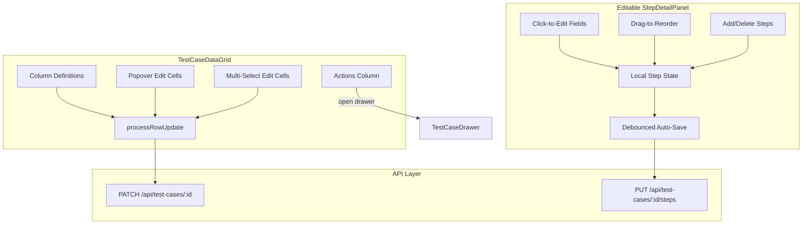

# Inline Editing for Test Case Grid and Steps

## Architecture Overview




## Part 1: Additional Inline-Editable Test Case Columns

Currently editable: `title`, `automation_status`, `priority`, `category`. Need to add: `type`, `tags`, `platform_tags`, `description`, `precondition`.

### 1a. Simple singleSelect: `type`

In [TestCaseDataGrid.tsx](src/components/test-cases/TestCaseDataGrid.tsx), add `editable: canWrite` and `type: 'singleSelect'` with `valueOptions` to the `type` column (line ~~309). Add the diff for `type` in `processRowUpdate` (~~line 172).

### 1b. Custom edit cells for array fields: `platform_tags`, `tags`

Create two new components:

- `**src/components/test-cases/edit-cells/PlatformTagsEditCell.tsx**` — Renders a Popover/Popper anchored to the cell with the 3 platform chips (desktop/tablet/mobile) as toggle chips. Uses `apiRef.setEditCellValue()` to commit.
- `**src/components/test-cases/edit-cells/TagsEditCell.tsx**` — Renders an `Autocomplete` with `freeSolo` and `multiple` in a Popover. Commit on blur or Enter.

Wire both via `renderEditCell` on their respective columns in `TestCaseDataGrid.tsx`. Add diffs for `platform_tags` and `tags` in `processRowUpdate`.

### 1c. Popover edit cells for long text: `description`, `precondition`

Create:

- `**src/components/test-cases/edit-cells/TextPopoverEditCell.tsx**` — Renders a Popover with a multi-line `TextField` (3-6 rows). Commits on blur or Cmd+Enter. Shared by both `description` and `precondition` columns.

Add `description` and `precondition` columns to the grid (they don't currently exist as columns). Use `renderCell` to show truncated text, `renderEditCell` to show the popover. Add diffs in `processRowUpdate`.

### 1d. Update `processRowUpdate`

Extend the diff logic in `processRowUpdate` to detect changes in all new fields: `type`, `platform_tags`, `tags`, `description`, `precondition`. For arrays, use JSON comparison.

## Part 2: Row Click Behavior and Actions Column

### 2a. Replace `onRowClick` with actions column

In [TestCaseDataGrid.tsx](src/components/test-cases/TestCaseDataGrid.tsx):

- Add a new `actions` column using MUI Data Grid's `type: 'actions'` with a `GridActionsCellItem` that renders an "open in drawer" icon (e.g. `OpenInNewIcon` or `EditNoteIcon`).
- Remove the `onRowClick` handler that opens the drawer. Replace with `onOpenDrawer` prop that the actions column calls.
- Keep `onRowClick` in the prop interface but repurpose it (or remove it — the pages pass it only for drawer opening).

### 2b. Update page-level wiring

In both [suite page](src/app/(dashboard)/projects/[projectId]/suites/[suiteId]/page.tsx) and [project page](src/app/(dashboard)/projects/[projectId]/page.tsx):

- Rename the current `onRowClick` usage to the new `onOpenDrawer` prop.
- The grid no longer opens the drawer on row click; the action button does.

## Part 3: Editable StepDetailPanel (Core Lift)

### 3a. Convert `StepDetailPanel` to editable

Replace the read-only table in [StepDetailPanel.tsx](src/components/test-cases/StepDetailPanel.tsx) with an inline-editable table when `canWrite` is true:

- **Click-to-edit pattern**: Each text cell (`description`, `test_data`, `expected_result`) shows static text by default. On click/double-click, it transforms into a compact `TextField`. On blur, it commits to local state.
- **Category**: Click shows a `Select` dropdown inline.
- `**is_automation_only`**: Small switch/checkbox inline in the `#` column.
- **Add step**: "+" button row at the bottom of the table.
- **Delete step**: Trash icon on hover for each row.
- **Drag-to-reorder**: Add `@dnd-kit` sortable to table rows (reuse the sensor config and pattern from [StepEditor.tsx](src/components/test-cases/StepEditor.tsx)). Show drag handle on hover.

### 3b. Local state + debounced auto-save

The panel manages its own `useState<StepWithStatus[]>` initialized from props. On any edit:

1. Update local state immediately (optimistic)
2. Debounce (800ms) then call `onStepsUpdate(testCaseId, steps)` — a new callback prop
3. Show save status indicator in the panel header

The parent page's `onStepsUpdate` handler calls `PUT /api/test-cases/:id/steps` using the existing replace-all endpoint. No API changes needed.

### 3c. New props for StepDetailPanel

```typescript
interface StepDetailPanelProps {
  steps: StepWithStatus[];
  platforms: Platform[];
  canWrite: boolean;
  selectedRunId?: string | null;
  testCaseId: string;
  onStatusChange?: (...) => void;
  // New:
  onStepsUpdate?: (testCaseId: string, steps: StepData[]) => Promise<void>;
}
```

### 3d. Dynamic detail panel height

Update `getDetailPanelHeight` in `TestCaseDataGrid.tsx` to account for:

- The add-step button row
- Slightly taller rows (editable fields need more vertical space)
- Use a callback that adjusts when steps are added/removed (may require the panel to communicate height changes via `apiRef.current.updateDetailPanel()` or a state-based approach)

## Part 4: Wire Steps Save into Pages

### 4a. Add `onStepsUpdate` handler to both pages

In both the suite page and project page, add:

```typescript
const handleStepsUpdate = async (testCaseId: string, steps: StepData[]) => {
  setSaveStatus('saving');
  try {
    const res = await fetch(`/api/test-cases/${testCaseId}/steps`, {
      method: 'PUT',
      headers: { 'Content-Type': 'application/json' },
      body: JSON.stringify({ steps }),
    });
    if (res.ok) {
      // Update local test case state with new steps
      setSaveStatus('saved');
      // ... refresh steps in local row data
    } else {
      setSaveStatus('error');
    }
  } catch {
    setSaveStatus('error');
  }
};
```

### 4b. Pass through TestCaseDataGrid

Add `onStepsUpdate` as a new prop on `TestCaseDataGrid`, threaded into `StepDetailPanel` via `getDetailPanelContent`.

### 4c. Sync after drawer save

When the drawer saves and calls `onSaved`, the page refetches test cases. The detail panel should pick up the new steps from the refreshed row data. Ensure the panel resets its local state when props change (compare by step IDs or a version counter).

## Part 5: Save Status Indicator

The existing [GridToolbar.tsx](src/components/test-cases/GridToolbar.tsx) already shows a save indicator (`saving` / `saved` / `error`) driven by `SaveStatus`. The `handleRowUpdate` in both pages already sets this. The new `handleStepsUpdate` will also set it. No new toast component needed — the toolbar indicator covers it.

## Key Files Modified


| File                                                                 | Changes                                                                                                                         |
| -------------------------------------------------------------------- | ------------------------------------------------------------------------------------------------------------------------------- |
| `src/components/test-cases/TestCaseDataGrid.tsx`                     | New columns, actions column, remove `onRowClick` handler, add `onOpenDrawer` + `onStepsUpdate` props, extend `processRowUpdate` |
| `src/components/test-cases/StepDetailPanel.tsx`                      | Full rewrite to support inline editing, drag-reorder, add/delete, auto-save                                                     |
| `src/components/test-cases/edit-cells/PlatformTagsEditCell.tsx`      | New file                                                                                                                        |
| `src/components/test-cases/edit-cells/TagsEditCell.tsx`              | New file                                                                                                                        |
| `src/components/test-cases/edit-cells/TextPopoverEditCell.tsx`       | New file                                                                                                                        |
| `src/app/(dashboard)/projects/[projectId]/page.tsx`                  | Wire `onOpenDrawer`, `onStepsUpdate`, remove row-click drawer logic                                                             |
| `src/app/(dashboard)/projects/[projectId]/suites/[suiteId]/page.tsx` | Same as above                                                                                                                   |


