# MVP Gap Remediation Plan

Addresses every gap identified in the N1-N8 audit plus wiring up partial S1/S3 work. Organized from quick wins to larger structural changes so each phase is independently shippable.

---

## Phase A — Quick Integration Fixes

Small wiring/UI changes where the components or APIs already exist.

### A1: Wire StepAutocomplete into StepEditor (N2 AC-5)

`StepAutocomplete` exists at `src/components/test-cases/StepAutocomplete.tsx` with props `{ value, onChange, onSelect, projectId }` but is never imported into `StepEditor`.

- Add `projectId?: string` prop to `StepEditor` (and `StepRow`) in [src/components/test-cases/StepEditor.tsx](src/components/test-cases/StepEditor.tsx)
- Replace the Description `TextField` (lines 142-152) with `<StepAutocomplete>`, passing `value`, `onChange`, `onSelect` (which also fills `test_data` and `expected_result`)
- Thread `projectId` from `TestCaseDrawer` -> `StepEditor` -> `StepRow`. The drawer fetches suite, which has `project_id`
- Handle `onSelect` to update multiple fields at once (may need a batch update helper in `StepRow` since `onChange` currently takes one field at a time)

### A2: Add platform_tags to BulkEditToolbar (N2 AC-4)

API already supports `platform_tags` in PATCH `/api/test-cases/bulk`.

- In [src/components/test-cases/BulkEditToolbar.tsx](src/components/test-cases/BulkEditToolbar.tsx), after the Priority select (line ~120), add a multi-chip selector for platforms (Desktop, Tablet, Mobile)
- Add `platform_tags` to the `BulkEditUpdates` type and `handleApply`

### A3: Add automation_file_path to TestCaseDrawer (S1 AC-4)

Validation already accepts it in `updateTestCaseSchema` (line 26). Schema column exists.

- In [src/components/test-cases/TestCaseDrawer.tsx](src/components/test-cases/TestCaseDrawer.tsx), add state for `automationFilePath`
- Add a `TextField` after the Automation Status select (~line 352), conditionally shown when `automation_status !== 'not_automated'`
- Include in `handleSave` payloads for both create and update
- Add `automation_file_path` to `createTestCaseSchema` in [src/lib/validations/test-case.ts](src/lib/validations/test-case.ts)

### A4: Show description and CI link on run detail page (S1 AC-3)

GET already returns `description`. `process-playwright.ts` stores CI URL as `"Automated run from CI: {url}"`.

- In [src/app/(dashboard)/runs/[runId]/page.tsx](src/app/(dashboard)/runs/[runId]/page.tsx), render `run.description` below the name/chips area
- Parse CI URLs from description (regex for `https?://...`) and render as clickable `Link` components
- For automated runs, show a "CI Build" chip that links to the extracted URL

---

## Phase B — Grid View Enhancements

### B1: Add CombinedStatusDisplay to TestCaseDataGrid (N3 AC-6)

- Modify the test cases API (`/api/test-cases` GET in [src/app/api/test-cases/route.ts](src/app/api/test-cases/route.ts)) to optionally join latest execution status per platform when a `include_status=true` query param is passed
- Add a new column definition in [src/components/test-cases/TestCaseDataGrid.tsx](src/components/test-cases/TestCaseDataGrid.tsx) after `automation_status` (~line 167) using `CombinedStatusDisplay` as `renderCell`
- Extend the `TestCaseRow` type to include `platformStatus?: Record<string, string>`
- Update suite and project pages to pass `include_status=true` and thread the data

### B2: Add execution status filter to GridFilterBar (N6 AC-2)

- In [src/components/test-cases/GridFilterBar.tsx](src/components/test-cases/GridFilterBar.tsx), add `execution_status: ExecutionStatus[]` to `FilterValues` (line ~22)
- Add a new entry to `FILTER_DEFS` with options: pass, fail, blocked, skip, not_run
- Update `handleClearAll` and `hasActiveFilters`
- In the suite/project pages, apply the filter against the `platformStatus` data from B1

### B3: Version history user name resolution (N2 AC-3)

- In [src/components/test-cases/TestCaseDrawer.tsx](src/components/test-cases/TestCaseDrawer.tsx), update the version history fetch (~line 125) to join `profiles` on `changed_by` to get `full_name`
- Or add a `.select('*, profiles:changed_by(full_name)')` to the versions query
- Render the user name alongside each version entry (~lines 330-340)

---

## Phase C — Execution Tracking Enhancements

### C1: Environment chip selector (N3 AC-1)

- In [src/components/test-runs/CreateTestRunDialog.tsx](src/components/test-runs/CreateTestRunDialog.tsx), replace the Environment `TextField` (~line 148) with a set of toggle `Chip` components: Desktop (Primary), Tablet (Info)
- Allow multi-select (the run targets multiple environments)
- Store as comma-separated or keep as a free-text field with structured values

### C2: Browser dimension in execution UI (N3 AC-3, AC-4)

This is the most structurally complex change. The schema already supports `browser` on `execution_results`.

**API changes:**

- In [src/app/api/test-runs/[runId]/results/route.ts](src/app/api/test-runs/[runId]/results/route.ts), ensure GET returns `browser` field and allow filtering by browser
- In the PUT handler, accept and validate `browser` (currently hardcoded to `'default'`)

**ExecutionMatrix refactor:**

- In [src/components/execution/ExecutionMatrix.tsx](src/components/execution/ExecutionMatrix.tsx), extend `ResultMap` type to `{ [stepId]: { [platform]: { [browser]: { status, id? } } } }`
- Add a browser selector above the matrix (e.g. tab bar for Chrome, Safari, Firefox, etc.)
- Two display modes: (a) step-by-platform for a single browser (current layout + browser tabs), or (b) browser-by-platform for a single step (spec's AC-4 matrix)
- Add a "View by browser" toggle that switches the matrix orientation

**Execute page:**

- In [src/app/(dashboard)/runs/[runId]/execute/[caseId]/page.tsx](src/app/(dashboard)/runs/[runId]/execute/[caseId]/page.tsx), update `buildResultMap` (~lines 71-80) to include browser dimension
- Add browser selection state; pass selected browser to `ExecutionMatrix`
- Update `handleStatusChange` (~line 109) to use selected browser instead of `'default'`

---

## Phase D — CSV Import Completeness

### D1: Auto-create import test run for pass/fail data (N1 AC-3)

When the CSV contains platform results (pass/fail/blocked), create an import test run and store execution results.

- In [src/app/api/csv-import/route.ts](src/app/api/csv-import/route.ts), after creating test cases and steps:
  1. Check if any parsed steps have `platform_results`
  2. If yes, create a `test_run` with `name: "Import — {suite.prefix}"`, `is_automated: false`, `source: 'csv_import'`
  3. Create `test_run_cases` for each imported case
  4. Create `execution_results` for each step's platform results, linking to the correct `test_step_id`, `platform`, and `browser: 'default'`
  5. Store execution dates if available (map to `executed_at`)
- Update `ImportWizard.tsx` to pass `platform_results` per step and `execution_dates` in the API payload (~lines 315-320)
- Add `source: 'csv_import'` to the `test_runs.source` allowed values (currently only `'manual'` and `'playwright_webhook'`)

### D2: Improve column auto-detection fallback (N1 AC-2)

- In [src/lib/csv/column-mapper.ts](src/lib/csv/column-mapper.ts), add fuzzy rules for execution date columns and overall status
- In [src/components/csv-import/ImportWizard.tsx](src/components/csv-import/ImportWizard.tsx), relax the header detection pattern (~lines 58-62) — fall back to treating the first row as headers when the strict pattern doesn't match

### D3: Import wizard UI polish (N1 UI)

- Add Framer Motion `AnimatePresence` + slide/fade transitions between wizard steps in `ImportWizard.tsx`
- Add toast notifications (MUI `Snackbar`) for completion states in `ImportCompleteStep.tsx` instead of only inline messages
- Optional: enhance `ColumnMapper.tsx` with a two-column layout (CSV headers left, system fields right)

---

## Phase E — Suite Drag-and-Drop (N4 AC-6)

### E1: API support for moving test cases between suites

- Add `suite_id` to `updateTestCaseSchema` in [src/lib/validations/test-case.ts](src/lib/validations/test-case.ts): `suite_id: z.string().uuid().optional()`
- In [src/app/api/test-cases/[testCaseId]/route.ts](src/app/api/test-cases/[testCaseId]/route.ts) PATCH handler, when `suite_id` changes, keep existing `display_id` and history (do not regenerate ID)
- Consider edge cases: display_id uniqueness across suites (currently globally unique via `UNIQUE` constraint, so no collision risk)

### E2: Drag-and-drop UI for test cases between suites

- In the project page [src/app/(dashboard)/projects/[projectId]/page.tsx](src/app/(dashboard)/projects/[projectId]/page.tsx), implement `@dnd-kit` drag-and-drop
- Test case cards/rows are draggable; suites are drop targets
- On drop, call PATCH `/api/test-cases/{id}` with the new `suite_id`
- Visual feedback: suite highlights on hover, success flash on drop (per design-system.md spec)
- Note: The spec says "maintains its existing ID and all associated history" — we do NOT regenerate `display_id`

---

## Phase F — S-Feature Forward Wiring

Expose existing schema infrastructure with minimal UI so future S-feature work has something to build on.

### F1: Performance test criteria placeholder (S3 AC-1)

- When `type === 'performance'` is selected in `TestCaseDrawer`, show additional fields for response time threshold and throughput target
- Store these in `test_cases.metadata` JSONB (the column exists and is indexed)
- No ingestion or threshold evaluation logic yet — just the data entry

### F2: Document remaining S-feature architecture

- Verify all 7 placeholder tables have proper RLS write policies for when they're activated (currently only SELECT may be enabled)
- Add TODO comments in relevant code pointing to S-feature docs (e.g. `integrations` page, `comments` table usage)
- This is documentation/cleanup, not feature work

---

## Dependency Graph

```mermaid
graph TD
    A1["A1: StepAutocomplete wiring"]
    A2["A2: BulkEdit platform_tags"]
    A3["A3: automation_file_path UI"]
    A4["A4: CI link on run detail"]
    B1["B1: CombinedStatus in grid"]
    B2["B2: Execution status filter"]
    B3["B3: Version history username"]
    C1["C1: Environment chips"]
    C2["C2: Browser dimension"]
    D1["D1: Import test run creation"]
    D2["D2: Column auto-detect"]
    D3["D3: Import UI polish"]
    E1["E1: Move cases API"]
    E2["E2: DnD between suites"]
    F1["F1: Perf test metadata"]
    F2["F2: S-feature docs"]

    B1 --> B2
    E1 --> E2
    D2 --> D1
```

Phase A items are independent and can be done in parallel. Phase B depends on B1 before B2. Phase C items are independent. Phase D items flow D2 -> D1. Phase E flows E1 -> E2. Phase F is independent.

---

## Out of Scope (confirmed by user)

- N7 AC-1 email sending — keeping manual URL copy for now
- S2 (automated triggering), S4 (Slack), S5 (GitLab), S6 (custom fields UI), S7 (collaboration) — no implementation, only placeholder schema exists

