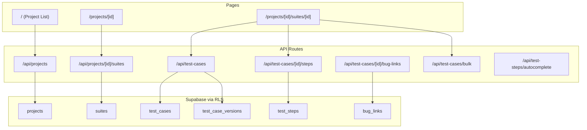

# Phase 1 -- Core Data Hierarchy (N4 + N2)

## Architecture

All mutations go through Next.js API routes following the pattern in `.cursor/rules/api-routes.mdc`: authenticate via `supabase.auth.getUser()`, authorize via `profiles.role`, validate with Zod, then execute with the RLS-scoped Supabase client.

The UI uses Client Components for interactive parts (forms, drawers, inline editing) and fetches data via API routes. No additional state management library -- React state + the existing `AuthProvider` context is sufficient.




## New File Structure

```
src/
  app/
    (dashboard)/
      page.tsx                                 -- Rewrite: project list with cards
      projects/
        [projectId]/
          page.tsx                             -- Project detail: suite list
          suites/
            [suiteId]/
              page.tsx                         -- Suite view: test case list
    api/
      projects/
        route.ts                               -- GET (list), POST (create)
        [projectId]/
          route.ts                             -- GET, PATCH, DELETE
          suites/
            route.ts                           -- GET (list), POST (create)
            [suiteId]/
              route.ts                         -- GET, PATCH, DELETE
            reorder/
              route.ts                         -- PATCH (reorder positions)
      test-cases/
        route.ts                               -- POST (create in suite)
        [testCaseId]/
          route.ts                             -- GET, PATCH, DELETE
          steps/
            route.ts                           -- GET, PUT (replace all), PATCH (reorder)
          bug-links/
            route.ts                           -- GET, POST
            [bugLinkId]/
              route.ts                         -- DELETE
        bulk/
          route.ts                             -- PATCH (bulk update)
      test-steps/
        autocomplete/
          route.ts                             -- GET (trigram search)
  components/
    projects/
      ProjectCard.tsx                          -- Card with name, suite count, pass rate ring
      CreateProjectDialog.tsx                  -- Modal form
      EditProjectDialog.tsx                    -- Modal form
    suites/
      SuiteList.tsx                            -- Sortable list with color dots
      CreateSuiteDialog.tsx                    -- Modal with prefix preview
      EditSuiteDialog.tsx                      -- Modal form
    test-cases/
      TestCaseTable.tsx                        -- Main list with inline edit
      TestCaseDrawer.tsx                       -- Side drawer for full detail
      StepEditor.tsx                           -- Step add/edit/reorder/delete
      BulkEditToolbar.tsx                      -- Slide-down batch edit bar
      AutomationBadge.tsx                      -- Colored status chip
      PlatformChips.tsx                        -- Platform tag chips
      BugLinksList.tsx                         -- URL list with add/remove
      StepAutocomplete.tsx                     -- Trigram autocomplete input
    common/
      ConfirmDialog.tsx                        -- Reusable confirm/cancel modal
      EmptyState.tsx                           -- Illustration + CTA placeholder
  lib/
    validations/
      project.ts                               -- Zod schemas for project CRUD
      suite.ts                                 -- Zod schemas for suite CRUD
      test-case.ts                             -- Zod schemas for test case CRUD + bulk
      test-step.ts                             -- Zod schemas for steps
      bug-link.ts                              -- Zod schemas for bug links
    api/
      helpers.ts                               -- Shared auth + role check + error helpers
```

---

## 1.1 -- Validation Schemas + API Helpers

Create reusable API authentication/authorization helpers and all Zod validation schemas.

**Key files:**

- [src/lib/api/helpers.ts](src/lib/api/helpers.ts) -- `withAuth(request, requiredPermission)` helper that handles auth check, profile fetch, and returns `{ user, profile, supabase }` or an error `NextResponse`. Eliminates boilerplate in every route.
- [src/lib/validations/project.ts](src/lib/validations/project.ts) -- `createProjectSchema` (name: string 1-100, description: string | null), `updateProjectSchema` (partial + is_archived)
- [src/lib/validations/suite.ts](src/lib/validations/suite.ts) -- `createSuiteSchema` (name, prefix 1-10 uppercase, description), `updateSuiteSchema`, `reorderSuitesSchema` (array of `{ id, position }`)
- [src/lib/validations/test-case.ts](src/lib/validations/test-case.ts) -- `createTestCaseSchema` (suite_id, title, description, precondition, type, automation_status, platform_tags, priority, tags), `updateTestCaseSchema`, `bulkUpdateSchema`
- [src/lib/validations/test-step.ts](src/lib/validations/test-step.ts) -- `stepSchema` (description, test_data, expected_result, is_automation_only, step_number), `replaceStepsSchema` (array of steps)
- [src/lib/validations/bug-link.ts](src/lib/validations/bug-link.ts) -- `createBugLinkSchema` (url, title, provider, external_id)

---

## 1.2 -- Projects API + Project List Page

Build project CRUD and replace the dashboard home with a project card grid.

**API routes:**

- `GET /api/projects` -- list all projects (RLS handles visibility). Join with suite count and test case count.
- `POST /api/projects` -- create project. Requires `write` permission. Set `created_by` to `user.id`.
- `GET /api/projects/[projectId]` -- single project with suite details.
- `PATCH /api/projects/[projectId]` -- update name, description, is_archived. Requires `write` (or `delete_project` for archive toggle by admin).
- `DELETE /api/projects/[projectId]` -- hard delete. Requires `delete_project` permission (Admin only).

**UI:**

- Rewrite [src/app/(dashboard)/page.tsx](src/app/(dashboard)/page.tsx) to render project cards in a responsive grid (3 cols on large, 2 on medium, 1 on small).
- `ProjectCard.tsx`: dark surface card with 1px neutral border, 8px radius. Shows name, description, suite count, test case count. Hover: primary border glow (150ms). Click navigates to `/projects/[id]`.
- `CreateProjectDialog.tsx`: MUI Dialog with name + description fields. "New Project" button (primary filled) visible only if `can('write')`.
- `EditProjectDialog.tsx`: pre-filled form, archive toggle.
- `ConfirmDialog.tsx`: reusable confirm/cancel for delete actions.
- `EmptyState.tsx`: shown when no projects exist, with a CTA to create one.

---

## 1.3 -- Suites API + Suite Management

Build suite CRUD within a project, including prefix validation, color assignment, and drag-and-drop reordering.

**API routes:**

- `GET /api/projects/[projectId]/suites` -- list suites for project, ordered by `position`.
- `POST /api/projects/[projectId]/suites` -- create suite. Auto-assign `color_index` (count of existing suites % 5 to cycle through `semanticColors.suiteColors`). Set `position` to max + 1. Validate prefix uniqueness within project.
- `PATCH /api/projects/[projectId]/suites/[suiteId]` -- update name, description, prefix.
- `DELETE /api/projects/[projectId]/suites/[suiteId]` -- Admin only. Cascade deletes test cases.
- `PATCH /api/projects/[projectId]/suites/reorder` -- accept `[{ id, position }]` array, update all positions in one query.

**UI:**

- [src/app/(dashboard)/projects/[projectId]/page.tsx](src/app/(dashboard)/projects/%5BprojectId%5D/page.tsx): project detail page. Header with project name + edit/archive buttons. Suite list below.
- `SuiteList.tsx`: ordered list of suite cards with colored left-border (4px, suite accent color from `semanticColors.suiteColors[color_index]`). Each card shows prefix badge, name, test case count. Click navigates to `/projects/[id]/suites/[suiteId]`.
- Drag-and-drop reorder: use `@dnd-kit/core` + `@dnd-kit/sortable` (need to install). Dropped item calls the reorder API. Visual: lifted card shadow + placeholder ghost.
- `CreateSuiteDialog.tsx`: name + prefix (uppercase, 1-10 chars) + description. Live preview: typing "SR" shows "SR-1" in a neutral chip.
- `EditSuiteDialog.tsx`: pre-filled form. Prefix change should warn if test cases exist (IDs won't retroactively change).

**New dependency:** `@dnd-kit/core`, `@dnd-kit/sortable`, `@dnd-kit/utilities`

---

## 1.4 -- Sidebar Project/Suite Tree

Upgrade the sidebar from static nav items to a dynamic project → suites hierarchy.

**Changes to [src/components/layout/Sidebar.tsx](src/components/layout/Sidebar.tsx):**

- Keep "Projects" as the top-level nav item (links to `/` project list).
- Below it, fetch and display the current project's suites when viewing a project or suite page. Detect project from the URL path.
- Each suite shown as a tree item with a colored dot (suite accent color) and prefix label.
- Active suite: accent color left border + name highlighted, using the existing `motion.div layoutId="sidebar-indicator"` pattern.
- "Test Runs" and "Reports" remain disabled placeholders.
- When sidebar is collapsed, suite tree is hidden.

**Data fetching:** The sidebar is a Client Component. Fetch suites via `/api/projects/[projectId]/suites` when the projectId from the URL changes. Use `usePathname()` to extract the project ID.

---

## 1.5 -- Test Cases API + List Page

Build the test case CRUD API and the suite-level test case list view.

**API routes:**

- `POST /api/test-cases` -- create test case. Accepts `suite_id`. Calls `generate_test_case_id(suite_id)` via `supabase.rpc()` to atomically get the `display_id` and `sequence_number`. Set `created_by`, `updated_by`. Requires `write`.
- `GET /api/test-cases/[testCaseId]` -- single test case with steps (joined) and bug links.
- `PATCH /api/test-cases/[testCaseId]` -- update any field. The `snapshot_test_case_version()` trigger fires automatically on UPDATE to create version history.
- `DELETE /api/test-cases/[testCaseId]` -- Admin only (cascades to steps, versions, bug links).

**UI:**

- [src/app/(dashboard)/projects/[projectId]/suites/[suiteId]/page.tsx](src/app/(dashboard)/projects/%5BprojectId%5D/suites/%5BsuiteId%5D/page.tsx): suite view page. Header with suite name + prefix badge + create button. Below: test case table.
- `TestCaseTable.tsx`: table using MUI `Table` (not Data Grid Pro yet -- that's Phase 3/N6). Columns: display_id, title, automation status badge, platform chips, priority, updated_at. Row hover: primary wash 8%. Click opens detail drawer.
- `AutomationBadge.tsx`: colored chip -- IN CICD (success/teal), SCRIPTED (info/violet), OUT OF SYNC (warning/amber), Not Automated (neutral/slate).
- `PlatformChips.tsx`: small chips for desktop (primary), tablet (info), mobile (success).
- Create test case: button opens the detail drawer in create mode.

---

## 1.6 -- Test Case Drawer + Step Editor

Build the side drawer for viewing/editing a test case and the full step management UI.

**UI:**

- `TestCaseDrawer.tsx`: slides in from right (250ms, uses `slideIn` variant from [src/lib/animations/variants.ts](src/lib/animations/variants.ts)). Full-width on mobile, ~600px on desktop. Contains:
  - Header: display_id chip + title
  - Form fields: title, description (multiline), precondition (multiline), type dropdown, automation_status dropdown, platform_tags multi-select, priority dropdown, tags input
  - Step editor section
  - Bug links section
  - Version history section (read-only list of past versions)
  - Footer: Save / Cancel buttons (hidden for Viewers)
- `StepEditor.tsx`: ordered list of step rows. Each row has: step number, description, test_data, expected_result, is_automation_only toggle. Add step button at bottom. Drag-and-drop reorder. Delete with confirmation. Steps with `is_automation_only = true` show an info/violet "Auto Only" chip and faint info wash background.

**API:**

- `PUT /api/test-cases/[testCaseId]/steps` -- replace all steps (send full ordered array). Deletes existing, inserts new. This simplifies reorder + add + delete into one atomic operation.
- `GET /api/test-cases/[testCaseId]/steps` -- list steps ordered by `step_number`.

---

## 1.7 -- Inline Editing + Auto-Save

Add double-click inline editing on the test case table and auto-save with debounce.

**Inline editing on `TestCaseTable.tsx`:**

- Double-click a cell (title, description, automation_status, platform_tags, priority) to enter edit mode.
- Active edit cell: primary border at full opacity + slight inner glow.
- On blur or Enter: save via `PATCH /api/test-cases/[testCaseId]`. Brief success flash (border goes success for 500ms, then fades to neutral).
- Debounced auto-save: 1 second debounce for text fields. Immediate save for dropdown/toggle changes.
- Auto-save indicator in the toolbar: spinner (primary) while saving, checkmark (success) for 2 seconds after save, error icon (error) on failure with retry.

**Version history:**

- The DB trigger `snapshot_test_case_version()` already fires on test_case UPDATE, so version history is automatic.
- In the drawer, show a "Version History" expandable section listing past versions with: version number, changed_by (profile name), created_at timestamp, change_summary.
- Clicking a version shows a JSON diff (simple key-value comparison, not a full diff UI -- keep it minimal for MVP).

---

## 1.8 -- Bulk Edit

Multi-select test cases and batch update common fields.

**UI:**

- Checkbox column in `TestCaseTable.tsx`. "Select all" checkbox in header.
- `BulkEditToolbar.tsx`: slides down from top of table when 1+ rows selected (250ms ease-out). Shows count ("3 selected"), field dropdowns (automation_status, platform_tags, priority, type), "Apply" (primary filled), "Cancel" (neutral outlined).
- Apply calls `PATCH /api/test-cases/bulk`.

**API:**

- `PATCH /api/test-cases/bulk` -- body: `{ ids: string[], updates: Partial<TestCase> }`. Validates that all IDs exist and belong to the same project. Updates in a single query. Requires `write`.

---

## 1.9 -- Bug Links + Step Autocomplete

**Bug links:**

- `BugLinksList.tsx` in the drawer: list of external URLs with title, provider icon, and remove button. "Add Link" button opens inline form with URL + title fields.
- `POST /api/test-cases/[testCaseId]/bug-links` -- create link. Auto-detect provider from URL domain (e.g., "gitlab.com" -> "gitlab", "jira" -> "jira").
- `DELETE /api/test-cases/[testCaseId]/bug-links/[bugLinkId]` -- remove link.

**Step autocomplete:**

- `StepAutocomplete.tsx`: when typing in a step description field, after 2+ characters, query the trigram GIN index on `test_steps.description`.
- `GET /api/test-steps/autocomplete?q=...&project_id=...` -- returns top 10 matching step descriptions. Scoped to the same project.
- Dropdown below input (150ms fade-in). Matching text highlighted in primary. Select to fill description + test_data + expected_result from the matched step.

---

## 1.10 -- Verification + RBAC Polish

**Viewer enforcement (across all new UI):**

- All "Create", "Edit", "Delete", "Bulk Edit" buttons: hidden when `can('write')` returns false.
- Inline editing: disabled for Viewers (double-click does nothing).
- If a Viewer somehow triggers a write API: returns 403 with message.
- Info toast if Viewer attempts a blocked action via keyboard shortcut: "View-only access. Contact an Admin for edit permissions."

**TopBar breadcrumbs:** wire up the breadcrumb in [src/components/layout/TopBar.tsx](src/components/layout/TopBar.tsx) to show the current navigation path: Home > Project Name > Suite Name.

**Final checks:**

- `npm run build` passes with zero errors and zero warnings
- Full CRUD flow works: create project -> create suite -> create test case with steps -> edit inline -> bulk edit -> add bug link -> version history shows changes
- Viewer role sees read-only UI everywhere
- Auto-generated IDs are atomic (SR-1, SR-2, etc.)
- Sidebar reflects project/suite hierarchy dynamically

---

## Exit Criteria (from roadmap)

- Can create projects and suites with unique prefixes
- Test cases get auto-generated IDs (e.g., SR-1, SR-2)
- Full CRUD on test cases and steps
- Version history records changes automatically
- Viewer role cannot create/edit -- UI controls hidden, API returns 403
- `npm run build` passes with no errors

