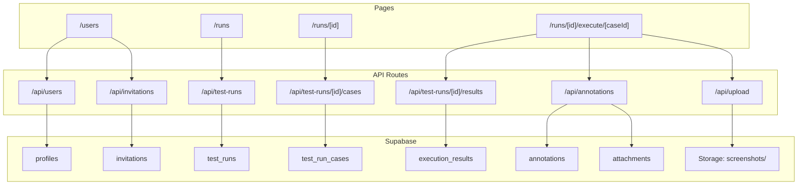

# Phase 2 -- Users and Execution (N7 + N3)

## Architecture

Phase 2 follows the same patterns established in Phase 1: API routes with `withAuth()` + Zod validation, Client Components fetching via `fetch()`, RBAC enforced at both API and UI layers. The new addition is **Supabase Storage** for screenshot uploads, accessed via signed URLs.




## Relevant Schema (already created in Phase 0 migration)

All tables exist in the database from Phase 0. Phase 2 wires them up:

- `**profiles**` -- user list, role assignment (`role` column update)
- `**invitations**` -- email, role, token, status, expires_at (RLS: Admin only)
- `**test_runs**` -- project_id, suite_id, name, status, assignee_id, dates
- `**test_run_cases**` -- test_run_id, test_case_id, overall_status (unique pair)
- `**execution_results**` -- test_run_id, test_case_id, test_step_id, platform, browser, status (unique composite)
- `**annotations**` -- execution_result_id, comment, created_by
- `**attachments**` -- annotation_id, storage_path, file_name, mime_type
- **Storage bucket:** `screenshots/{project_id}/{test_run_id}/{annotation_id}_{filename}`

## New File Structure

```
src/
  app/
    (dashboard)/
      users/
        page.tsx                                   -- User list + invitation panel (Admin only)
      runs/
        page.tsx                                   -- Test run list (all projects)
        [runId]/
          page.tsx                                 -- Test run detail: case list + status summary
          execute/
            [caseId]/
              page.tsx                             -- Execution: step x platform matrix
    api/
      users/
        route.ts                                   -- GET (list profiles), PATCH role
        [userId]/
          route.ts                                 -- PATCH (role assignment)
      invitations/
        route.ts                                   -- GET (list), POST (create)
        [invitationId]/
          route.ts                                 -- PATCH (revoke), DELETE
      test-runs/
        route.ts                                   -- GET (list), POST (create)
        [runId]/
          route.ts                                 -- GET, PATCH (status/metadata), DELETE
          cases/
            route.ts                               -- GET (cases in run), POST (add cases), DELETE (remove)
          results/
            route.ts                               -- GET (all results for run), PUT (batch upsert)
          status/
            route.ts                               -- PATCH (recompute overall_status for all cases)
      annotations/
        route.ts                                   -- POST (create with optional attachment)
        [annotationId]/
          route.ts                                 -- GET, DELETE
      upload/
        route.ts                                   -- POST (screenshot to Supabase Storage)
  components/
    users/
      UserTable.tsx                                -- Profile table with role badges
      InviteUserDialog.tsx                         -- Email + role invite form
      RoleSelect.tsx                               -- Inline role dropdown
    test-runs/
      TestRunCard.tsx                              -- Run card with status, dates, progress
      CreateTestRunDialog.tsx                      -- Modal: name, project, suite, dates, assignee
      TestRunCaseSelector.tsx                      -- Checkbox list to pick cases for a run
      TestRunStatusBadge.tsx                       -- Colored chip: planned/in_progress/completed/aborted
    execution/
      ExecutionMatrix.tsx                          -- Step rows x platform columns grid
      ExecutionStatusCell.tsx                      -- Single status cell with click-to-change
      StatusBadge.tsx                              -- Pass/Fail/Blocked/Skip/Not Run badge
      AnnotationPanel.tsx                          -- Comment + screenshot panel for a failed step
      CombinedStatusDisplay.tsx                    -- Mini platform badges (e.g., "Pass Desktop, Fail Tablet")
  lib/
    validations/
      invitation.ts                                -- Zod schemas for invitations
      test-run.ts                                  -- Zod schemas for test runs + case selection
      execution-result.ts                          -- Zod schemas for results + annotations
```

---

## 2.1 -- Validation Schemas

Create Zod schemas for all Phase 2 entities, following the same pattern as Phase 1 (see [src/lib/validations/project.ts](src/lib/validations/project.ts)).

**Key files:**

- [src/lib/validations/invitation.ts](src/lib/validations/invitation.ts) -- `createInvitationSchema` (email, role enum), `updateInvitationSchema` (status)
- [src/lib/validations/test-run.ts](src/lib/validations/test-run.ts) -- `createTestRunSchema` (project_id, suite_id optional, name, description, target_version, environment, start_date, due_date, assignee_id), `updateTestRunSchema` (partial fields + status), `addCasesSchema` (array of test_case_ids), `removeCasesSchema`
- [src/lib/validations/execution-result.ts](src/lib/validations/execution-result.ts) -- `upsertResultsSchema` (array of `{ test_case_id, test_step_id, platform, browser, status }`), `createAnnotationSchema` (execution_result_id, comment)

---

## 2.2 -- User List Page + Role Assignment

Build the Admin-only user management page. Uses existing `profiles` table and `manage_users` permission from [src/lib/auth/rbac.ts](src/lib/auth/rbac.ts).

**API routes:**

- `GET /api/users` -- list all profiles. Requires `manage_users`. Returns id, email, full_name, avatar_url, role, is_active, last_active_at.
- `PATCH /api/users/[userId]` -- update role. Requires `manage_users`. Validates new role is a valid `user_role` enum value. Cannot demote yourself.

**UI:**

- [src/app/(dashboard)/users/page.tsx](src/app/(dashboard)/users/page.tsx): Admin-only page. If not Admin, redirect to `/` or show forbidden message.
- `UserTable.tsx`: MUI Table with avatar, name, email, role badge (using `semanticColors.role`), last active. Inline role dropdown (`RoleSelect.tsx`) for Admins to change a user's role -- immediate save via PATCH.
- `RoleSelect.tsx`: small MUI Select showing role options with colored badges next to each. Calls PATCH on change.
- Add "Users" nav item to the sidebar (visible only to Admins, using `can('manage_users')` check).

---

## 2.3 -- Invitation Flow

Build the invitation create/list/revoke workflow. The `invitations` table is Admin-only (RLS).

**API routes:**

- `GET /api/invitations` -- list all invitations. Requires `manage_users`.
- `POST /api/invitations` -- create invitation. Requires `manage_users`. Generate a crypto-random token, set `expires_at` to 7 days from now. **Email sending:** For MVP, do NOT integrate a real email provider. Instead, generate the invite URL (`/invite/[token]`) and return it in the API response. The Admin copies and shares it manually. A toast shows the link. Future: hook up Supabase Edge Function or Resend for real email.
- `PATCH /api/invitations/[invitationId]` -- revoke (set status to `revoked`). Requires `manage_users`.

**Invitation acceptance page:**

- [src/app/(auth)/invite/[token]/page.tsx](src/app/(auth)/invite/%5Btoken%5D/page.tsx): public page. Looks up invitation by token. If valid + pending + not expired, shows "You've been invited as [Role]. Sign in with Google to accept." Clicking the Google sign-in button triggers OAuth. On successful sign-in callback, the app checks if the signed-in email matches the invitation email, updates `invitations.status` to `accepted`, and sets `profiles.role` to the invited role.
- The acceptance logic runs in the auth callback route [src/app/auth/callback/route.ts](src/app/auth/callback/route.ts) -- after exchanging the code for a session, check for a pending invitation matching the user's email and apply the role.

**UI integration:**

- `InviteUserDialog.tsx`: email input + role dropdown. On submit, shows the generated invite URL in a copyable chip/alert.
- Invitations tab or section on the Users page: table showing pending/accepted/expired/revoked invitations with status badges.

---

## 2.4 -- Test Run CRUD API

Build the test run lifecycle APIs. Tables: `test_runs`, `test_run_cases`.

**API routes:**

- `GET /api/test-runs` -- list runs. Accepts `?project_id=` filter. Join with project name, suite name, assignee name, and counts (total cases, pass/fail/not_run). Ordered by created_at desc.
- `POST /api/test-runs` -- create run. Requires `write`. Set `created_by`, status defaults to `planned`.
- `GET /api/test-runs/[runId]` -- single run with full details: metadata, case count breakdown by status, assignee profile.
- `PATCH /api/test-runs/[runId]` -- update metadata or status. Requires `write`. When status changes to `completed` or `aborted`, set `completed_at` to now.
- `DELETE /api/test-runs/[runId]` -- Admin only. Cascades to test_run_cases, execution_results, annotations, attachments.

**Test run case management:**

- `GET /api/test-runs/[runId]/cases` -- list `test_run_cases` for a run, joined with `test_cases` (display_id, title, suite prefix) and aggregated execution status per platform.
- `POST /api/test-runs/[runId]/cases` -- add cases to run. Body: `{ test_case_ids: string[] }`. Creates `test_run_cases` rows with `overall_status = 'not_run'`. Also pre-creates `execution_results` rows for each step x platform combination (based on the test case's `platform_tags`) with status `not_run`, so the matrix is ready to fill in.
- `DELETE /api/test-runs/[runId]/cases` -- remove cases from run. Body: `{ test_case_ids: string[] }`. Cascades to execution results.

---

## 2.5 -- Test Run List + Creation UI

Build the runs list page and creation dialog.

**Pages:**

- [src/app/(dashboard)/runs/page.tsx](src/app/(dashboard)/runs/page.tsx): lists all test runs. Filter by project (dropdown). Each run shown as a `TestRunCard.tsx`.
- `TestRunCard.tsx`: dark card with run name, status badge, project/suite label, date range, assignee avatar, progress bar (pass/fail/blocked/not_run stacked horizontal bar using execution status colors).
- `CreateTestRunDialog.tsx`: modal form. Project dropdown (required), suite dropdown (optional, filters to selected project), name, description, target_version, environment, start/due dates, assignee dropdown (profiles list). On create, navigates to the new run's detail page.
- `TestRunStatusBadge.tsx`: `planned` (neutral), `in_progress` (primary), `completed` (success), `aborted` (error).

**Sidebar:** Enable the "Test Runs" nav item in [src/components/layout/Sidebar.tsx](src/components/layout/Sidebar.tsx) -- remove `disabled: true` and set href to `/runs`.

---

## 2.6 -- Test Run Detail + Case Selection

Build the test run detail page where you view the run and select/manage which test cases are included.

**Page:** [src/app/(dashboard)/runs/[runId]/page.tsx](src/app/(dashboard)/runs/%5BrunId%5D/page.tsx)

- Header: run name, status badge, metadata (project, suite, version, environment, dates, assignee).
- Status controls: buttons to move through lifecycle (`Start` -> in_progress, `Complete` -> completed, `Abort` -> aborted). Only shown for `write` users.
- Case list: table of test_run_cases showing display_id, title, `CombinedStatusDisplay.tsx` (platform mini-badges), overall_status badge. Click navigates to the execution page for that case.
- "Add Cases" button: opens `TestRunCaseSelector.tsx`.

`**TestRunCaseSelector.tsx`:** modal/drawer showing all test cases in the project (or scoped suite). Checkboxes for multi-select. Already-added cases shown as checked + disabled. "Add Selected" creates the test_run_cases + pre-built execution_result rows.

---

## 2.7 -- Execution Matrix + Status Recording

Build the step-by-step execution page with the platform matrix.

**Page:** [src/app/(dashboard)/runs/[runId]/execute/[caseId]/page.tsx](src/app/(dashboard)/runs/%5BrunId%5D/execute/%5BcaseId%5D/page.tsx)

- Breadcrumb: Test Runs > Run Name > Case Display ID.
- Test case info header: display_id, title, precondition, description.
- `ExecutionMatrix.tsx`: table where **rows = test steps** (step number + description) and **columns = platforms** (Desktop, Tablet -- only the platforms in the case's `platform_tags`). Within each platform column, sub-columns for each browser (default: "default" unless explicitly configured).
- Each cell is an `ExecutionStatusCell.tsx`: shows current status badge. Click cycles through: not_run -> pass -> fail -> blocked -> skip -> not_run. Or a small dropdown. Each status change calls `PUT /api/test-runs/[runId]/results` to upsert that single result row.
- Steps with `is_automation_only = true`: show an info chip, cells are pre-set to `skip` for manual runs.
- After every status update, recompute `test_run_cases.overall_status` for this case (worst-status logic: fail > blocked > skip > not_run > pass).

**API:**

- `PUT /api/test-runs/[runId]/results` -- batch upsert execution results. Body: array of `{ test_case_id, test_step_id, platform, browser, status }`. Uses `ON CONFLICT (test_run_id, test_step_id, platform, browser) DO UPDATE`. Sets `executed_by` and `executed_at`. Requires `write`.
- `GET /api/test-runs/[runId]/results?case_id=...` -- get all execution results for a specific case in a run, grouped by step and platform.
- `PATCH /api/test-runs/[runId]/status` -- recompute and update `overall_status` for all test_run_cases in the run based on their execution_results. Called after result changes.

`**StatusBadge.tsx`:** reusable badge using `semanticColors.executionStatus` colors. Pass = success/teal + checkmark, Fail = error/coral + X, Blocked = warning/amber + block, Skip = neutral + skip icon, Not Run = neutral-light + dash.

---

## 2.8 -- Failure Annotations + Screenshot Upload

Build the annotation panel that appears when a step fails, and the Supabase Storage integration for screenshots.

**Supabase Storage setup:** The `screenshots` bucket needs to be created in the Supabase dashboard (or via a migration/API call). Storage RLS policies allow authenticated users to upload and read.

**API:**

- `POST /api/annotations` -- create annotation with comment. Requires `write`. Body: `{ execution_result_id, comment }`.
- `GET /api/annotations/[annotationId]` -- get annotation with attachments.
- `DELETE /api/annotations/[annotationId]` -- delete annotation + attachments. Admin or creator.
- `POST /api/upload` -- upload screenshot to Supabase Storage. Requires `write`. Accepts `multipart/form-data` with file + metadata (project_id, test_run_id, annotation_id). Validates mime type (image/png, image/jpeg, image/webp, image/gif) and max size (5MB). Uploads to `screenshots/{project_id}/{test_run_id}/{annotation_id}_{filename}`. Returns the storage path. Creates an `attachments` row.

**UI:**

- `AnnotationPanel.tsx`: shown below/beside a failed execution cell. Comment textarea + "Add Screenshot" drag-and-drop zone. Existing annotations listed with comment text, thumbnails (via Supabase signed URLs), and delete buttons.
- On the execution matrix page, when a cell status is `fail`, an expand/panel area opens below the step row showing annotations for that result.

---

## 2.9 -- Combined Status + Run Lifecycle

Build the aggregated status displays and the run status lifecycle.

`**CombinedStatusDisplay.tsx`:** shows in the run detail case list and eventually in the grid view (Phase 3). For each platform in the case's tags, shows a mini-badge with that platform's color tint + the execution status color fill. If all platforms pass: single "All Pass" success badge. If mixed: side-by-side mini-badges (e.g., `[check Desktop]` in primary tint with success fill + `[X Tablet]` in info tint with error fill).

**Run-level status aggregation:** The test run detail page header shows a summary bar:

- Total cases, pass count, fail count, blocked count, not_run count.
- Horizontal stacked progress bar (pass=success, fail=error, blocked=warning, not_run=neutral).
- Pass rate percentage.

**Lifecycle transitions:**

- `planned` -> `in_progress`: triggered by "Start Run" button or automatically when first result is recorded.
- `in_progress` -> `completed`: triggered by "Complete Run" button. Sets `completed_at`.
- `in_progress` -> `aborted`: triggered by "Abort Run" button. Sets `completed_at`.
- Status badge updates reflect the current state using `TestRunStatusBadge.tsx`.

---

## 2.10 -- Verification + Polish

**Viewer enforcement audit across all new UI:**

- Users page: completely hidden for non-Admins (redirect or no nav link).
- Test run creation, case selection, status recording: buttons hidden when `can('write')` is false.
- Execution matrix: cells are read-only for Viewers (no click-to-change).
- Annotation/upload: add buttons hidden for Viewers.
- All new write APIs return 403 for Viewer role.

**Sidebar updates:**

- "Test Runs" nav item: remove `disabled: true`, set href to `/runs`.
- "Users" nav item: add new entry visible only when `can('manage_users')` is true, with a people icon.

**TopBar breadcrumbs:** extend the breadcrumb logic in [src/components/layout/TopBar.tsx](src/components/layout/TopBar.tsx) to handle `/users`, `/runs`, `/runs/[runId]`, and `/runs/[runId]/execute/[caseId]` paths.

**Final checks:**

- `npm run build` passes with zero errors and zero warnings.
- Admin can invite users and assign roles.
- New user signs in with Google -> gets the invited role.
- Viewer confirmed locked out of all writes.
- Test runs can be created, cases selected, results recorded per step x platform.
- Failed steps show annotation panel, screenshots upload and display.
- Combined status shows correctly on run detail page.

---

## Exit Criteria (from roadmap)

- Admin can invite users, assign roles
- New user signs in with Google -> gets invited role
- Viewer confirmed locked out of all writes
- Test runs can be created, cases selected, results recorded per step x platform
- Screenshots upload to Supabase Storage and display inline
- `npm run build` passes with no errors

