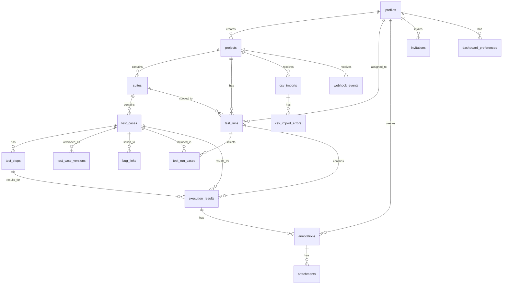
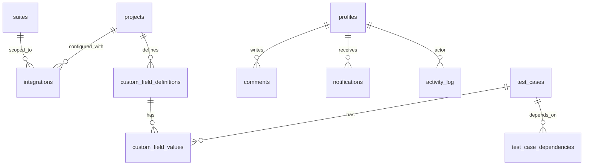

# Database Schema (ERD)

> Supabase Postgres — designed for TestForge MVP (N1–N8) with forward-compatible placeholders for SOON features (S1–S7) and post-MVP enhancements (dashboard, suite merge).

## Entity Relationship Diagram



### Future Extensions (S1–S7)



---

## Enums

```sql
CREATE TYPE user_role AS ENUM (
  'admin',
  'qa_engineer',
  'sdet',
  'viewer'
);

CREATE TYPE test_case_type AS ENUM (
  'functional',
  'performance'          -- S3: extensible for future types
);

CREATE TYPE test_case_category AS ENUM (
  'smoke',
  'regression',
  'integration',
  'e2e',
  'unit',
  'acceptance',
  'exploratory',
  'performance',
  'security',
  'usability'
);

CREATE TYPE automation_status AS ENUM (
  'not_automated',
  'scripted',            -- script exists, not in pipeline
  'in_cicd',             -- actively running in CI/CD
  'out_of_sync'          -- automation exists but stale
);

CREATE TYPE execution_status AS ENUM (
  'not_run',
  'pass',
  'fail',
  'blocked',
  'skip'
);

CREATE TYPE platform AS ENUM (
  'desktop',
  'tablet',
  'mobile'               -- reserved for post-MVP
);

CREATE TYPE invitation_status AS ENUM (
  'pending',
  'accepted',
  'expired',
  'revoked'
);

CREATE TYPE test_run_status AS ENUM (
  'planned',
  'in_progress',
  'completed',
  'aborted'
);

CREATE TYPE webhook_event_status AS ENUM (
  'pending',
  'processing',
  'success',
  'failed'
);

CREATE TYPE import_status AS ENUM (
  'pending',
  'processing',
  'completed',
  'failed'
);
```

---

## MVP Tables

### `profiles`

Extends Supabase `auth.users`. Every authenticated user gets a profile row.

| Column           | Type          | Constraints                                           | Notes                             |
| ---------------- | ------------- | ----------------------------------------------------- | --------------------------------- |
| `id`             | `uuid`        | **PK**, references `auth.users(id)` ON DELETE CASCADE | Same ID as Supabase Auth          |
| `email`          | `text`        | UNIQUE, NOT NULL                                      | Google Workspace email            |
| `full_name`      | `text`        |                                                       | From Google OAuth profile         |
| `avatar_url`     | `text`        |                                                       | Google profile picture URL        |
| `role`           | `user_role`   | NOT NULL, DEFAULT `'viewer'`                          | App-level role                    |
| `is_active`      | `boolean`     | NOT NULL, DEFAULT `true`                              | Soft-disable without deleting     |
| `last_active_at` | `timestamptz` |                                                       | Updated on authenticated requests |
| `created_at`     | `timestamptz` | NOT NULL, DEFAULT `now()`                             |                                   |
| `updated_at`     | `timestamptz` | NOT NULL, DEFAULT `now()`                             |                                   |

**Indexes:** `idx_profiles_email` on `email`, `idx_profiles_role` on `role`

---

### `invitations`

Pending user invitations sent by Admins (N7 AC-1).

| Column        | Type                | Constraints                         | Notes                                  |
| ------------- | ------------------- | ----------------------------------- | -------------------------------------- |
| `id`          | `uuid`              | **PK**, DEFAULT `gen_random_uuid()` |                                        |
| `email`       | `text`              | NOT NULL                            | Invitee's Google Workspace email       |
| `role`        | `user_role`         | NOT NULL                            | Role assigned on acceptance            |
| `invited_by`  | `uuid`              | FK → `profiles(id)`, NOT NULL       | Admin who sent the invite              |
| `token`       | `text`              | UNIQUE, NOT NULL                    | Secure token for the registration link |
| `status`      | `invitation_status` | NOT NULL, DEFAULT `'pending'`       |                                        |
| `accepted_at` | `timestamptz`       |                                     | Set when user completes registration   |
| `expires_at`  | `timestamptz`       | NOT NULL                            | Auto-expire stale invitations          |
| `created_at`  | `timestamptz`       | NOT NULL, DEFAULT `now()`           |                                        |

**Indexes:** `idx_invitations_email` on `email`, `idx_invitations_token` on `token`, `idx_invitations_status` on `status`

---

### `projects`

Top-level container for suites, runs, and integrations (N4 AC-1).

| Column        | Type          | Constraints                         | Notes                               |
| ------------- | ------------- | ----------------------------------- | ----------------------------------- |
| `id`          | `uuid`        | **PK**, DEFAULT `gen_random_uuid()` |                                     |
| `name`        | `text`        | NOT NULL                            | e.g., "Marketplace"                 |
| `description` | `text`        |                                     |                                     |
| `is_archived` | `boolean`     | NOT NULL, DEFAULT `false`           | Soft-archive for completed projects |
| `created_by`  | `uuid`        | FK → `profiles(id)`, NOT NULL       |                                     |
| `created_at`  | `timestamptz` | NOT NULL, DEFAULT `now()`           |                                     |
| `updated_at`  | `timestamptz` | NOT NULL, DEFAULT `now()`           |                                     |

**Indexes:** `idx_projects_archived` on `is_archived`

---

### `suites`

Logical grouping of test cases within a project (N4 AC-2). Maps to individual sheet tabs in the current Google Sheets workflow.

| Column          | Type          | Constraints                                     | Notes                                                                    |
| --------------- | ------------- | ----------------------------------------------- | ------------------------------------------------------------------------ |
| `id`            | `uuid`        | **PK**, DEFAULT `gen_random_uuid()`             |                                                                          |
| `project_id`    | `uuid`        | FK → `projects(id)` ON DELETE CASCADE, NOT NULL |                                                                          |
| `name`          | `text`        | NOT NULL                                        | e.g., "Sponsor Registration"                                             |
| `prefix`        | `text`        | NOT NULL                                        | e.g., "SR" — used for test case ID generation                            |
| `description`   | `text`        |                                                 |                                                                          |
| `color_index`   | `smallint`    | NOT NULL, DEFAULT `0`                           | Cycles through palette: 0=Primary, 1=Success, 2=Info, 3=Warning, 4=Error |
| `position`      | `integer`     | NOT NULL, DEFAULT `0`                           | Display order in sidebar                                                 |
| `next_sequence` | `integer`     | NOT NULL, DEFAULT `1`                           | Next auto-increment number for test case IDs                             |
| `tags`          | `text[]`      | NOT NULL, DEFAULT `'{}'`                        | Freeform tags for suite-level filtering (e.g. "regression", "smoke")     |
| `group`         | `text`        |                                                 | Optional grouping label for organizing suites in the sidebar             |
| `created_by`    | `uuid`        | FK → `profiles(id)`, NOT NULL                   |                                                                          |
| `created_at`    | `timestamptz` | NOT NULL, DEFAULT `now()`                       |                                                                          |
| `updated_at`    | `timestamptz` | NOT NULL, DEFAULT `now()`                       |                                                                          |

**Constraints:** `UNIQUE(project_id, prefix)`

**Indexes:** `idx_suites_project` on `project_id`, `idx_suites_position` on `(project_id, position)`, `idx_suites_tags` GIN on `tags`, `idx_suites_group` on `group`

**ID generation logic:** When a test case is created, atomically read `next_sequence`, set `display_id = prefix || '-' || next_sequence`, then increment `next_sequence`. Use a Postgres function with row-level locking to prevent race conditions.

---

### `test_cases`

Individual test cases within a suite (N2 AC-1). Each maps to a collapsible row group in the current spreadsheet.

| Column                 | Type                 | Constraints                                                 | Notes                                                                            |
| ---------------------- | -------------------- | ----------------------------------------------------------- | -------------------------------------------------------------------------------- |
| `id`                   | `uuid`               | **PK**, DEFAULT `gen_random_uuid()`                         | Internal identifier                                                              |
| `suite_id`             | `uuid`               | FK → `suites(id)` ON DELETE CASCADE, NOT NULL               |                                                                                  |
| `display_id`           | `text`               | UNIQUE, NOT NULL                                            | Human-readable ID, e.g., "SR-1"                                                  |
| `sequence_number`      | `integer`            | NOT NULL                                                    | Numeric part of display_id                                                       |
| `title`                | `text`               | NOT NULL                                                    | Test case name                                                                   |
| `description`          | `text`               |                                                             | Full scenario narrative                                                          |
| `precondition`         | `text`               |                                                             | State required before execution                                                  |
| `type`                 | `test_case_type`     | NOT NULL, DEFAULT `'functional'`                            | Extensible for S3 performance tests                                              |
| `automation_status`    | `automation_status`  | NOT NULL, DEFAULT `'not_automated'`                         |                                                                                  |
| `automation_file_path` | `text`               |                                                             | Path to Playwright test file (S1 AC-4)                                           |
| `platform_tags`        | `platform[]`         | NOT NULL, DEFAULT `'{}'`                                    | Which platforms this test targets                                                |
| `priority`             | `text`               | CHECK (`priority` IN ('low', 'medium', 'high', 'critical')) |                                                                                  |
| `tags`                 | `text[]`             | NOT NULL, DEFAULT `'{}'`                                    | Freeform tags (smoke, regression, etc.) for S2 filtering                         |
| `position`             | `integer`            | NOT NULL, DEFAULT `0`                                       | Display order within suite                                                       |
| `metadata`             | `jsonb`              | NOT NULL, DEFAULT `'{}'`                                    | Reserved for S6 custom field values                                              |
| `category`             | `test_case_category` |                                                             | Classification (smoke, regression, e2e, etc.) — used for filtering and reporting |
| `created_by`           | `uuid`               | FK → `profiles(id)`, NOT NULL                               |                                                                                  |
| `updated_by`           | `uuid`               | FK → `profiles(id)`                                         | Last editor (N2 AC-3)                                                            |
| `created_at`           | `timestamptz`        | NOT NULL, DEFAULT `now()`                                   |                                                                                  |
| `updated_at`           | `timestamptz`        | NOT NULL, DEFAULT `now()`                                   |                                                                                  |

**Indexes:** `idx_test_cases_suite` on `suite_id`, `idx_test_cases_display_id` on `display_id`, `idx_test_cases_automation_status` on `automation_status`, `idx_test_cases_position` on `(suite_id, position)`, `idx_test_cases_category` on `category`, `idx_test_cases_tags` GIN on `tags`, `idx_test_cases_metadata` GIN on `metadata`

---

### `test_steps`

Individual steps within a test case (N2 AC-1). Each maps to a row within a collapsible group in the spreadsheet.

| Column               | Type                 | Constraints                                       | Notes                                                                     |
| -------------------- | -------------------- | ------------------------------------------------- | ------------------------------------------------------------------------- |
| `id`                 | `uuid`               | **PK**, DEFAULT `gen_random_uuid()`               |                                                                           |
| `test_case_id`       | `uuid`               | FK → `test_cases(id)` ON DELETE CASCADE, NOT NULL |                                                                           |
| `step_number`        | `integer`            | NOT NULL                                          | Sequential: 1, 2, 3…                                                      |
| `description`        | `text`               | NOT NULL                                          | What the user does                                                        |
| `test_data`          | `text`               |                                                   | Specific data used (emails, URLs, etc.)                                   |
| `expected_result`    | `text`               |                                                   | What should happen after this step                                        |
| `is_automation_only` | `boolean`            | NOT NULL, DEFAULT `false`                         | Skipped during manual runs                                                |
| `category`           | `test_case_category` |                                                   | Step-level classification — present in DB but not currently exposed in UI |
| `created_at`         | `timestamptz`        | NOT NULL, DEFAULT `now()`                         |                                                                           |
| `updated_at`         | `timestamptz`        | NOT NULL, DEFAULT `now()`                         |                                                                           |

**Constraints:** `UNIQUE(test_case_id, step_number)`

**Indexes:** `idx_test_steps_case` on `test_case_id`, `idx_test_steps_description` GIN using `gin_trgm_ops` on `description` (for N2 AC-5 reusable step autocomplete)

---

### `test_runs`

A test execution session — manual or automated (N3 AC-1).

| Column                | Type              | Constraints                                     | Notes                                                      |
| --------------------- | ----------------- | ----------------------------------------------- | ---------------------------------------------------------- |
| `id`                  | `uuid`            | **PK**, DEFAULT `gen_random_uuid()`             |                                                            |
| `project_id`          | `uuid`            | FK → `projects(id)` ON DELETE CASCADE, NOT NULL |                                                            |
| `suite_id`            | `uuid`            | FK → `suites(id)` ON DELETE SET NULL            | NULL = project-wide run                                    |
| `name`                | `text`            | NOT NULL                                        | e.g., "Sprint 12 Regression — Desktop"                     |
| `description`         | `text`            |                                                 |                                                            |
| `target_version`      | `text`            |                                                 | e.g., "v2.4.1"                                             |
| `environment`         | `text`            |                                                 | e.g., "Staging", "Production"                              |
| `status`              | `test_run_status` | NOT NULL, DEFAULT `'planned'`                   |                                                            |
| `start_date`          | `timestamptz`     |                                                 | Planned start                                              |
| `due_date`            | `timestamptz`     |                                                 | Planned end                                                |
| `completed_at`        | `timestamptz`     |                                                 | Actual completion                                          |
| `is_automated`        | `boolean`         | NOT NULL, DEFAULT `false`                       | Distinguishes manual vs automated runs (N8)                |
| `source`              | `text`            | NOT NULL, DEFAULT `'manual'`                    | 'manual', 'playwright_webhook', 'ci_trigger'               |
| `assignee_id`         | `uuid`            | FK → `profiles(id)` ON DELETE SET NULL          |                                                            |
| `gitlab_pipeline_url` | `text`            |                                                 | URL of the GitLab CI pipeline that triggered this run (S2) |
| `created_by`          | `uuid`            | FK → `profiles(id)`, NOT NULL                   |                                                            |
| `created_at`          | `timestamptz`     | NOT NULL, DEFAULT `now()`                       |                                                            |
| `updated_at`          | `timestamptz`     | NOT NULL, DEFAULT `now()`                       |                                                            |

**Indexes:** `idx_test_runs_project` on `project_id`, `idx_test_runs_suite` on `suite_id`, `idx_test_runs_status` on `status`, `idx_test_runs_assignee` on `assignee_id`

---

### `test_run_cases`

Junction table — which test cases are selected for a given run. Allows partial runs and caches per-case aggregate status.

| Column           | Type               | Constraints                                       | Notes                            |
| ---------------- | ------------------ | ------------------------------------------------- | -------------------------------- |
| `id`             | `uuid`             | **PK**, DEFAULT `gen_random_uuid()`               |                                  |
| `test_run_id`    | `uuid`             | FK → `test_runs(id)` ON DELETE CASCADE, NOT NULL  |                                  |
| `test_case_id`   | `uuid`             | FK → `test_cases(id)` ON DELETE CASCADE, NOT NULL |                                  |
| `overall_status` | `execution_status` | NOT NULL, DEFAULT `'not_run'`                     | Cached aggregate of step results |
| `created_at`     | `timestamptz`      | NOT NULL, DEFAULT `now()`                         |                                  |

**Constraints:** `UNIQUE(test_run_id, test_case_id)`

**Indexes:** `idx_trc_run` on `test_run_id`, `idx_trc_case` on `test_case_id`

---

### `execution_results`

Per-step, per-platform, per-browser result within a test run (N3 AC-2, AC-3). This is the core execution tracking table.

| Column         | Type               | Constraints                                       | Notes                                          |
| -------------- | ------------------ | ------------------------------------------------- | ---------------------------------------------- |
| `id`           | `uuid`             | **PK**, DEFAULT `gen_random_uuid()`               |                                                |
| `test_run_id`  | `uuid`             | FK → `test_runs(id)` ON DELETE CASCADE, NOT NULL  |                                                |
| `test_case_id` | `uuid`             | FK → `test_cases(id)` ON DELETE CASCADE, NOT NULL | Denormalized for query performance             |
| `test_step_id` | `uuid`             | FK → `test_steps(id)` ON DELETE CASCADE, NOT NULL |                                                |
| `platform`     | `platform`         | NOT NULL                                          | desktop, tablet                                |
| `browser`      | `text`             | NOT NULL, DEFAULT `'default'`                     | e.g., "Chrome", "Safari", "iPad Air"           |
| `status`       | `execution_status` | NOT NULL, DEFAULT `'not_run'`                     |                                                |
| `executed_by`  | `uuid`             | FK → `profiles(id)` ON DELETE SET NULL            |                                                |
| `executed_at`  | `timestamptz`      |                                                   | When the status was recorded                   |
| `duration_ms`  | `integer`          |                                                   | Execution time (useful for automation results) |
| `created_at`   | `timestamptz`      | NOT NULL, DEFAULT `now()`                         |                                                |
| `updated_at`   | `timestamptz`      | NOT NULL, DEFAULT `now()`                         |                                                |

**Constraints:** `UNIQUE(test_run_id, test_step_id, platform, browser)`

**Indexes:** `idx_er_run` on `test_run_id`, `idx_er_case` on `test_case_id`, `idx_er_step` on `test_step_id`, `idx_er_status` on `status`, `idx_er_platform` on `platform`, `idx_er_composite` on `(test_run_id, test_case_id, platform)`

---

### `annotations`

Failure comments tied to a specific execution result (N3 AC-5).

| Column                | Type          | Constraints                                              | Notes                                              |
| --------------------- | ------------- | -------------------------------------------------------- | -------------------------------------------------- |
| `id`                  | `uuid`        | **PK**, DEFAULT `gen_random_uuid()`                      |                                                    |
| `execution_result_id` | `uuid`        | FK → `execution_results(id)` ON DELETE CASCADE, NOT NULL | Links to specific step + platform + browser result |
| `comment`             | `text`        |                                                          | Free-text annotation                               |
| `created_by`          | `uuid`        | FK → `profiles(id)`, NOT NULL                            |                                                    |
| `created_at`          | `timestamptz` | NOT NULL, DEFAULT `now()`                                |                                                    |
| `updated_at`          | `timestamptz` | NOT NULL, DEFAULT `now()`                                |                                                    |

**Indexes:** `idx_annotations_result` on `execution_result_id`

---

### `attachments`

Screenshot and file uploads linked to annotations (N3 AC-5). Files stored in Supabase Storage; this table holds metadata and references.

| Column          | Type          | Constraints                                        | Notes                                                               |
| --------------- | ------------- | -------------------------------------------------- | ------------------------------------------------------------------- |
| `id`            | `uuid`        | **PK**, DEFAULT `gen_random_uuid()`                |                                                                     |
| `annotation_id` | `uuid`        | FK → `annotations(id)` ON DELETE CASCADE, NOT NULL |                                                                     |
| `storage_path`  | `text`        | NOT NULL                                           | Supabase Storage path, e.g., `project-uuid/run-uuid/screenshot.png` |
| `file_name`     | `text`        | NOT NULL                                           | Original file name                                                  |
| `file_size`     | `bigint`      |                                                    | Bytes                                                               |
| `mime_type`     | `text`        |                                                    | e.g., "image/png"                                                   |
| `created_at`    | `timestamptz` | NOT NULL, DEFAULT `now()`                          |                                                                     |

**Indexes:** `idx_attachments_annotation` on `annotation_id`

---

### `test_case_versions`

Auto-save version history with user attribution (N2 AC-3). Stores full snapshots for point-in-time reconstruction.

| Column           | Type          | Constraints                                       | Notes                                                 |
| ---------------- | ------------- | ------------------------------------------------- | ----------------------------------------------------- |
| `id`             | `uuid`        | **PK**, DEFAULT `gen_random_uuid()`               |                                                       |
| `test_case_id`   | `uuid`        | FK → `test_cases(id)` ON DELETE CASCADE, NOT NULL |                                                       |
| `version_number` | `integer`     | NOT NULL                                          | Auto-incremented per test case                        |
| `snapshot`       | `jsonb`       | NOT NULL                                          | Full test case + steps state at this version          |
| `changed_by`     | `uuid`        | FK → `profiles(id)`, NOT NULL                     | User who triggered the save                           |
| `change_summary` | `text`        |                                                   | Auto-generated or user-supplied description of change |
| `created_at`     | `timestamptz` | NOT NULL, DEFAULT `now()`                         |                                                       |

**Constraints:** `UNIQUE(test_case_id, version_number)`

**Indexes:** `idx_tcv_case` on `test_case_id`, `idx_tcv_case_version` on `(test_case_id, version_number DESC)`

---

### `bug_links`

Structured references to external bug reports (N1 AC-3, S5-ready). Replaces the free-text "Bug report" column from the spreadsheets.

| Column            | Type          | Constraints                                       | Notes                                            |
| ----------------- | ------------- | ------------------------------------------------- | ------------------------------------------------ |
| `id`              | `uuid`        | **PK**, DEFAULT `gen_random_uuid()`               |                                                  |
| `test_case_id`    | `uuid`        | FK → `test_cases(id)` ON DELETE CASCADE, NOT NULL |                                                  |
| `url`             | `text`        | NOT NULL                                          | Full URL, e.g., `https://gitlab.com/…/issues/42` |
| `title`           | `text`        |                                                   | Issue title (synced from GitLab in S5)           |
| `external_id`     | `text`        |                                                   | e.g., GitLab issue `#42`                         |
| `external_status` | `text`        |                                                   | e.g., "open", "closed" (synced in S5)            |
| `provider`        | `text`        | NOT NULL, DEFAULT `'manual'`                      | 'manual', 'gitlab'                               |
| `created_by`      | `uuid`        | FK → `profiles(id)`                               |                                                  |
| `created_at`      | `timestamptz` | NOT NULL, DEFAULT `now()`                         |                                                  |
| `updated_at`      | `timestamptz` | NOT NULL, DEFAULT `now()`                         |                                                  |

**Indexes:** `idx_bug_links_case` on `test_case_id`, `idx_bug_links_external` on `(provider, external_id)`

---

### `csv_imports`

Tracks CSV import operations for audit and error reporting (N1).

| Column            | Type            | Constraints                                     | Notes                                             |
| ----------------- | --------------- | ----------------------------------------------- | ------------------------------------------------- |
| `id`              | `uuid`          | **PK**, DEFAULT `gen_random_uuid()`             |                                                   |
| `project_id`      | `uuid`          | FK → `projects(id)` ON DELETE CASCADE, NOT NULL |                                                   |
| `suite_id`        | `uuid`          | FK → `suites(id)` ON DELETE SET NULL            | Target suite for the import                       |
| `file_name`       | `text`          | NOT NULL                                        | Original uploaded file name                       |
| `file_size`       | `bigint`        |                                                 | Bytes                                             |
| `column_mappings` | `jsonb`         |                                                 | User-confirmed CSV column → system field mappings |
| `total_rows`      | `integer`       |                                                 | Total data rows in the CSV                        |
| `imported_count`  | `integer`       | NOT NULL, DEFAULT `0`                           | Successfully imported                             |
| `skipped_count`   | `integer`       | NOT NULL, DEFAULT `0`                           | Duplicates skipped                                |
| `error_count`     | `integer`       | NOT NULL, DEFAULT `0`                           | Rows that failed                                  |
| `status`          | `import_status` | NOT NULL, DEFAULT `'pending'`                   |                                                   |
| `imported_by`     | `uuid`          | FK → `profiles(id)`, NOT NULL                   |                                                   |
| `completed_at`    | `timestamptz`   |                                                 |                                                   |
| `created_at`      | `timestamptz`   | NOT NULL, DEFAULT `now()`                       |                                                   |

**Indexes:** `idx_csv_imports_project` on `project_id`, `idx_csv_imports_status` on `status`

---

### `csv_import_errors`

Per-row error details for failed CSV import rows (N1 AC-5).

| Column          | Type          | Constraints                                        | Notes                         |
| --------------- | ------------- | -------------------------------------------------- | ----------------------------- |
| `id`            | `uuid`        | **PK**, DEFAULT `gen_random_uuid()`                |                               |
| `import_id`     | `uuid`        | FK → `csv_imports(id)` ON DELETE CASCADE, NOT NULL |                               |
| `row_number`    | `integer`     |                                                    | Source CSV row                |
| `column_name`   | `text`        |                                                    | Which column caused the error |
| `error_message` | `text`        | NOT NULL                                           |                               |
| `raw_data`      | `jsonb`       |                                                    | Full raw row for debugging    |
| `created_at`    | `timestamptz` | NOT NULL, DEFAULT `now()`                          |                               |

**Indexes:** `idx_cie_import` on `import_id`

---

### `webhook_events`

Incoming webhook event log for Playwright CI/CD integration (N8 AC-1).

| Column          | Type                   | Constraints                                     | Notes                                     |
| --------------- | ---------------------- | ----------------------------------------------- | ----------------------------------------- |
| `id`            | `uuid`                 | **PK**, DEFAULT `gen_random_uuid()`             |                                           |
| `project_id`    | `uuid`                 | FK → `projects(id)` ON DELETE CASCADE, NOT NULL |                                           |
| `test_run_id`   | `uuid`                 | FK → `test_runs(id)` ON DELETE SET NULL         | Test run created from this event          |
| `provider`      | `text`                 | NOT NULL, DEFAULT `'playwright'`                | Extensible for S3 (k6, JMeter)            |
| `event_type`    | `text`                 | NOT NULL                                        | e.g., "pipeline_complete", "test_results" |
| `payload`       | `jsonb`                | NOT NULL                                        | Full webhook payload                      |
| `status`        | `webhook_event_status` | NOT NULL, DEFAULT `'pending'`                   |                                           |
| `error_message` | `text`                 |                                                 | Populated on failure                      |
| `processed_at`  | `timestamptz`          |                                                 |                                           |
| `created_at`    | `timestamptz`          | NOT NULL, DEFAULT `now()`                       |                                           |

**Indexes:** `idx_we_project` on `project_id`, `idx_we_status` on `status`, `idx_we_provider` on `provider`

---

### `grid_column_preferences`

Per-user grid layout preferences for customizable columns (N6 AC-1).

| Column          | Type          | Constraints                                     | Notes                                               |
| --------------- | ------------- | ----------------------------------------------- | --------------------------------------------------- |
| `id`            | `uuid`        | **PK**, DEFAULT `gen_random_uuid()`             |                                                     |
| `user_id`       | `uuid`        | FK → `profiles(id)` ON DELETE CASCADE, NOT NULL |                                                     |
| `project_id`    | `uuid`        | FK → `projects(id)` ON DELETE CASCADE, NOT NULL |                                                     |
| `suite_id`      | `uuid`        | FK → `suites(id)` ON DELETE CASCADE             | NULL = project-level default                        |
| `column_config` | `jsonb`       | NOT NULL                                        | Column order, widths, visibility, sort/filter state |
| `created_at`    | `timestamptz` | NOT NULL, DEFAULT `now()`                       |                                                     |
| `updated_at`    | `timestamptz` | NOT NULL, DEFAULT `now()`                       |                                                     |

**Constraints:** `UNIQUE(user_id, project_id, suite_id)`

---

### `dashboard_preferences`

Per-user dashboard card layout (post-MVP). Admin-only customization of card visibility and order.

| Column        | Type          | Constraints                                             | Notes                                     |
| ------------- | ------------- | ------------------------------------------------------- | ----------------------------------------- |
| `id`          | `uuid`        | **PK**, DEFAULT `gen_random_uuid()`                     |                                           |
| `user_id`     | `uuid`        | FK → `profiles(id)` ON DELETE CASCADE, NOT NULL, UNIQUE | One row per user                          |
| `card_config` | `jsonb`       | NOT NULL, DEFAULT `'[]'::jsonb`                         | Array of `{ card_id, visible, position }` |
| `created_at`  | `timestamptz` | NOT NULL, DEFAULT `now()`                               |                                           |
| `updated_at`  | `timestamptz` | NOT NULL, DEFAULT `now()`                               |                                           |

**RLS:** Users can only read/write their own row.

---

## Future Tables (Schema Placeholders)

These tables are **not used in MVP** but are included in the schema from day one to avoid migration pain later. They can ship empty.

### `integrations` (S4 Slack, S5 GitLab)

Per-project (or per-suite) configuration for external service integrations.

| Column       | Type          | Constraints                                     | Notes                                            |
| ------------ | ------------- | ----------------------------------------------- | ------------------------------------------------ |
| `id`         | `uuid`        | **PK**                                          |                                                  |
| `project_id` | `uuid`        | FK → `projects(id)` ON DELETE CASCADE, NOT NULL |                                                  |
| `suite_id`   | `uuid`        | FK → `suites(id)` ON DELETE SET NULL            | NULL = project-wide (S4 AC-3 allows suite-level) |
| `type`       | `text`        | NOT NULL                                        | 'slack', 'gitlab'                                |
| `config`     | `jsonb`       | NOT NULL, DEFAULT `'{}'`                        | Webhook URLs, API tokens, repo paths, etc.       |
| `is_active`  | `boolean`     | NOT NULL, DEFAULT `true`                        |                                                  |
| `created_by` | `uuid`        | FK → `profiles(id)`, NOT NULL                   |                                                  |
| `created_at` | `timestamptz` | NOT NULL, DEFAULT `now()`                       |                                                  |
| `updated_at` | `timestamptz` | NOT NULL, DEFAULT `now()`                       |                                                  |

---

### `comments` (S7 Collaboration)

Polymorphic threaded comments with @mentions. Separate from `annotations` which are scoped to execution results.

| Column        | Type          | Constraints                           | Notes                                  |
| ------------- | ------------- | ------------------------------------- | -------------------------------------- |
| `id`          | `uuid`        | **PK**                                |                                        |
| `parent_id`   | `uuid`        | FK → `comments(id)` ON DELETE CASCADE | NULL = top-level comment               |
| `entity_type` | `text`        | NOT NULL                              | 'test_case', 'test_run', 'suite', etc. |
| `entity_id`   | `uuid`        | NOT NULL                              | ID of the referenced entity            |
| `body`        | `text`        | NOT NULL                              | Supports @mention syntax               |
| `created_by`  | `uuid`        | FK → `profiles(id)`, NOT NULL         |                                        |
| `created_at`  | `timestamptz` | NOT NULL, DEFAULT `now()`             |                                        |
| `updated_at`  | `timestamptz` | NOT NULL, DEFAULT `now()`             |                                        |

---

### `activity_log` (S7 Collaboration)

Audit trail of all significant actions. Feeds the activity feed and can back version history display.

| Column        | Type          | Constraints                            | Notes                                                         |
| ------------- | ------------- | -------------------------------------- | ------------------------------------------------------------- |
| `id`          | `uuid`        | **PK**                                 |                                                               |
| `actor_id`    | `uuid`        | FK → `profiles(id)` ON DELETE SET NULL |                                                               |
| `action`      | `text`        | NOT NULL                               | e.g., 'created', 'updated', 'deleted', 'executed', 'imported' |
| `entity_type` | `text`        | NOT NULL                               | 'test_case', 'test_run', 'suite', 'project', etc.             |
| `entity_id`   | `uuid`        | NOT NULL                               |                                                               |
| `project_id`  | `uuid`        | FK → `projects(id)` ON DELETE CASCADE  | For efficient project-scoped queries                          |
| `diff`        | `jsonb`       |                                        | Before/after snapshot or change details                       |
| `created_at`  | `timestamptz` | NOT NULL, DEFAULT `now()`              |                                                               |

---

### `notifications` (S7 Collaboration)

Notification dispatch queue for in-app, email, and Slack alerts.

| Column         | Type          | Constraints                                     | Notes                                                          |
| -------------- | ------------- | ----------------------------------------------- | -------------------------------------------------------------- |
| `id`           | `uuid`        | **PK**                                          |                                                                |
| `recipient_id` | `uuid`        | FK → `profiles(id)` ON DELETE CASCADE, NOT NULL |                                                                |
| `type`         | `text`        | NOT NULL                                        | 'mention', 'assignment', 'run_complete', 'failure_alert', etc. |
| `title`        | `text`        | NOT NULL                                        |                                                                |
| `body`         | `text`        |                                                 |                                                                |
| `entity_type`  | `text`        |                                                 | Linkable context                                               |
| `entity_id`    | `uuid`        |                                                 |                                                                |
| `channel`      | `text`        | NOT NULL, DEFAULT `'in_app'`                    | 'in_app', 'email', 'slack'                                     |
| `is_read`      | `boolean`     | NOT NULL, DEFAULT `false`                       |                                                                |
| `read_at`      | `timestamptz` |                                                 |                                                                |
| `created_at`   | `timestamptz` | NOT NULL, DEFAULT `now()`                       |                                                                |

---

### `custom_field_definitions` (S6 Advanced Test Cases)

Admin-defined custom fields per project.

| Column        | Type          | Constraints                                     | Notes                                                         |
| ------------- | ------------- | ----------------------------------------------- | ------------------------------------------------------------- |
| `id`          | `uuid`        | **PK**                                          |                                                               |
| `project_id`  | `uuid`        | FK → `projects(id)` ON DELETE CASCADE, NOT NULL |                                                               |
| `name`        | `text`        | NOT NULL                                        | e.g., "Regulation Type"                                       |
| `field_type`  | `text`        | NOT NULL                                        | 'text', 'number', 'select', 'multi_select', 'date', 'boolean' |
| `options`     | `jsonb`       |                                                 | For select/multi_select: `["Option A", "Option B"]`           |
| `is_required` | `boolean`     | NOT NULL, DEFAULT `false`                       |                                                               |
| `position`    | `integer`     | NOT NULL, DEFAULT `0`                           | Column display order                                          |
| `created_at`  | `timestamptz` | NOT NULL, DEFAULT `now()`                       |                                                               |
| `updated_at`  | `timestamptz` | NOT NULL, DEFAULT `now()`                       |                                                               |

---

### `custom_field_values` (S6 Advanced Test Cases)

Values for custom fields on individual test cases.

| Column                | Type          | Constraints                                                     | Notes                                                            |
| --------------------- | ------------- | --------------------------------------------------------------- | ---------------------------------------------------------------- |
| `id`                  | `uuid`        | **PK**                                                          |                                                                  |
| `field_definition_id` | `uuid`        | FK → `custom_field_definitions(id)` ON DELETE CASCADE, NOT NULL |                                                                  |
| `test_case_id`        | `uuid`        | FK → `test_cases(id)` ON DELETE CASCADE, NOT NULL               |                                                                  |
| `value`               | `jsonb`       | NOT NULL                                                        | Flexible: string, number, array, boolean depending on field_type |
| `created_at`          | `timestamptz` | NOT NULL, DEFAULT `now()`                                       |                                                                  |
| `updated_at`          | `timestamptz` | NOT NULL, DEFAULT `now()`                                       |                                                                  |

**Constraints:** `UNIQUE(field_definition_id, test_case_id)`

---

### `test_case_dependencies` (S6 Advanced Test Cases)

Directed dependency graph between test cases.

| Column          | Type          | Constraints                                       | Notes                      |
| --------------- | ------------- | ------------------------------------------------- | -------------------------- |
| `id`            | `uuid`        | **PK**                                            |                            |
| `test_case_id`  | `uuid`        | FK → `test_cases(id)` ON DELETE CASCADE, NOT NULL | The dependent test case    |
| `depends_on_id` | `uuid`        | FK → `test_cases(id)` ON DELETE CASCADE, NOT NULL | The prerequisite test case |
| `created_at`    | `timestamptz` | NOT NULL, DEFAULT `now()`                         |                            |

**Constraints:** `UNIQUE(test_case_id, depends_on_id)`, `CHECK(test_case_id != depends_on_id)`

---

## Supabase Storage

Screenshot attachments (N3 AC-5) use Supabase Storage with this bucket structure:

```
screenshots/
  └── {project_id}/
      └── {test_run_id}/
          └── {annotation_id}_{filename}
```

- Access controlled via Supabase Storage RLS policies tied to user role
- Signed URLs generated for display in the UI
- CDN delivery via Supabase's built-in CDN

---

## Row Level Security (RLS) Policy Guide

All tables have RLS enabled. Policies follow the role hierarchy: **Admin > SDET > QA Engineer > Viewer**.

| Table                   | SELECT            | INSERT                   | UPDATE                   | DELETE         |
| ----------------------- | ----------------- | ------------------------ | ------------------------ | -------------- |
| `profiles`              | All authenticated | — (created via trigger)  | Own profile or Admin     | Admin only     |
| `projects`              | All authenticated | Admin, QA Engineer, SDET | Admin, QA Engineer, SDET | Admin only     |
| `suites`                | All authenticated | Admin, QA Engineer, SDET | Admin, QA Engineer, SDET | Admin only     |
| `test_cases`            | All authenticated | Admin, QA Engineer, SDET | Admin, QA Engineer, SDET | Admin only     |
| `test_steps`            | All authenticated | Admin, QA Engineer, SDET | Admin, QA Engineer, SDET | Admin only     |
| `test_runs`             | All authenticated | Admin, QA Engineer, SDET | Admin, QA Engineer, SDET | Admin only     |
| `execution_results`     | All authenticated | Admin, QA Engineer, SDET | Admin, QA Engineer, SDET | Admin only     |
| `annotations`           | All authenticated | Admin, QA Engineer, SDET | Own or Admin             | Admin only     |
| `attachments`           | All authenticated | Admin, QA Engineer, SDET | — (immutable)            | Admin or owner |
| `invitations`           | Admin only        | Admin only               | Admin only               | Admin only     |
| `webhook_events`        | Admin, SDET       | Service role only        | Service role only        | Admin only     |
| `dashboard_preferences` | Own row only      | Own row only             | Own row only             | Own row only   |

Viewer role: SELECT on all data tables, no write access. Edit controls disabled in the UI and blocked at the RLS layer.

---

## Database Functions & Triggers

### `generate_test_case_id(suite_id uuid)`

Atomically generates the next `display_id` for a suite. Uses `SELECT ... FOR UPDATE` on the suite row to prevent race conditions, reads `next_sequence`, constructs the ID, and increments the counter.

### `update_updated_at()`

Trigger function that sets `updated_at = now()` on every UPDATE. Applied to all tables with an `updated_at` column.

### `create_profile_on_signup()`

Trigger on `auth.users` INSERT that creates a corresponding `profiles` row with email, name, and avatar from the OAuth metadata.

### `snapshot_test_case_version()`

Trigger on `test_cases` UPDATE that captures a JSONB snapshot of the test case and its steps into `test_case_versions`, incrementing the version number.

### `update_test_case_display_ids_on_prefix_change()`

Trigger on `suites` AFTER UPDATE OF `prefix`. When a suite's prefix changes, cascades the update to all related `test_cases.display_id` values (e.g., renaming prefix from "SR" to "REG" updates "SR-1" → "REG-1"). Added in migration `00002_cascade_prefix_to_display_ids.sql`.

### `dashboard_summary(p_user_id uuid, p_role text)`

RPC function (`SECURITY DEFINER`) that returns all dashboard data in a single round-trip. Returns a `jsonb` object with three top-level keys: `user_section` (assigned runs, recent activity, personal stats), `global_section` (active projects, run overview, recent runs, pass rate, platform coverage), and `admin_section` (null for non-admins; user activity, pending invitations, system stats, webhook health, import activity). Added in migration `00004_dashboard.sql`.

### `merge_suites(p_source_suite_id uuid, p_target_suite_id uuid)`

RPC function (`SECURITY DEFINER`) that atomically merges two suites. Validates both suites belong to the same project, locks the target suite, reassigns all test cases from source to target with new `display_id` and `sequence_number` values, bumps the target's `next_sequence`, and deletes the source suite. Returns `{ moved_count, target_suite_id, target_prefix }`. Added in migration `00005_merge_suites.sql`.

---

## Key Design Decisions

| Decision                                        | Rationale                                                                                                                                                                                                                                                                       |
| ----------------------------------------------- | ------------------------------------------------------------------------------------------------------------------------------------------------------------------------------------------------------------------------------------------------------------------------------- |
| UUIDs for all PKs                               | Standard for Supabase; supports distributed ID generation and avoids sequential ID guessing                                                                                                                                                                                     |
| `display_id` separate from `id`                 | Human-readable IDs (e.g., "SR-1") are for display; UUIDs are for relationships and indexing                                                                                                                                                                                     |
| `execution_results` denormalizes `test_case_id` | Avoids a JOIN through `test_steps` for the most common query pattern (results by case in a run)                                                                                                                                                                                 |
| `test_run_cases` junction table                 | Allows selecting specific cases for a run (partial runs) and caching per-case aggregate status                                                                                                                                                                                  |
| `bug_links` as structured table                 | CSV import preserves free-text URLs now; the schema supports GitLab sync (S5) without migration                                                                                                                                                                                 |
| `metadata` JSONB on `test_cases`                | Lightweight path toward S6 custom fields without a full EAV pattern from day one                                                                                                                                                                                                |
| `tags` array on `test_cases`                    | Enables S2 tag-based filtering (smoke/regression) with a simple GIN index                                                                                                                                                                                                       |
| `platform` as enum                              | Finite set (desktop, tablet, mobile) with controlled extension                                                                                                                                                                                                                  |
| `browser` as text                               | Open-ended — Chrome, Safari, Firefox, Edge, iPad Air, etc. Not worth enumerating                                                                                                                                                                                                |
| Future tables created empty                     | Avoids migration risk later; empty tables have zero storage/performance cost                                                                                                                                                                                                    |
| `annotations` vs `comments`                     | `annotations` are MVP — tied to specific execution results. `comments` (S7) are polymorphic and broader in scope. Separate tables because they serve different purposes.                                                                                                        |
| `test_case_category` enum vs `tags` array       | `category` is a single structured classification (smoke, regression, e2e, etc.) for filtering and reporting. `tags` is a freeform array for ad-hoc labeling. Both exist because they serve complementary purposes — `category` enforces consistency, `tags` offers flexibility. |
| `test_steps.category` in DB but not in UI       | The column exists in the schema for forward compatibility but was removed from the step editor and detail panel UI during MVP to reduce noise. It can be re-exposed when step-level categorization becomes a need.                                                              |
